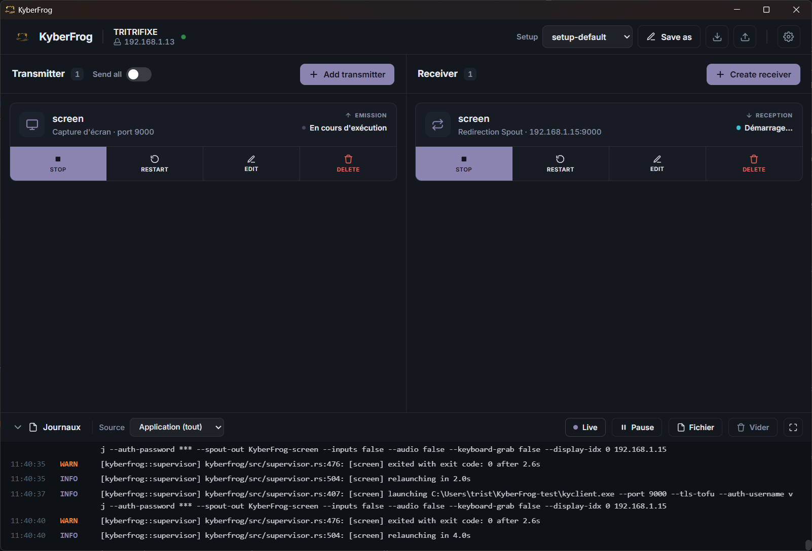

# KyberFrog 🐸

[](LICENSE)
[](https://gitlab.com/kyber-frog/kyberfrog/-/releases)
[](https://gitlab.com/kyber-frog/kyberfrog/-/pipelines)
[](https://kyber-anysource-b41fc4.gitlab.io/)
[](#)

> **KyberFrog lets you create transmitters and clients — from its dashboard on
> `:7700` — to send Spout, screen and webcam sources between machines with very
> low latency. Windows installer, Debian/Ubuntu package.**

A self-hosted, drop-in alternative to **NDI** for the LAN, built on
[Kyber](https://kyber.stream)'s QUIC video transport. **One app on every
machine**: whether a box *emits*, *receives*, or *both* is set by the config and
the dashboard — there is no separate server and client build, and a Windows
regie talks to a Linux display box without either side knowing.

📖 **[Documentation](https://kyber-anysource-b41fc4.gitlab.io/)** · 📦 **[Download](https://gitlab.com/kyber-frog/kyberfrog/-/releases)** · 🐸 Made for VJs (Resolume → Spout → LAN → displays)



## Features

- 🎥 **Any source → N transmitters** — Spout (Windows GPU texture share), screen
  capture, a webcam, or **every source at once** ("Tout envoyer": all monitors
  *and* all Spout senders on one transmitter, each viewer picks). The model
  grows more input types without touching the orchestration.
- 🔌 **One binary, any role** — emit, receive, or both, decided by the config and
  the dashboard. No "server vs client" builds.
- 🖱️ **Native dashboard, no browser tab needed** — a real window on Windows
  (WebView2), backed by the very same server on `:7700` that stays reachable
  from any browser on the LAN. Add and manage transmitters and viewers, watch
  live status, tail every child's logs.
- 🛰️ **Low-latency QUIC transport** — Kyber over the LAN, a drop-in NDI replacement.
- 🖥️ **Flexible viewers** — fullscreen displays, a windowless **Spout-out relay**
  (re-publish to Resolume/MadMapper), and a **remote-control** viewer (keyboard +
  mouse takeover over QUIC).
- 📦 **One self-contained package per platform** — a single-click Windows
  installer and a Debian/Ubuntu `.deb`, both bundling the Kyber fork binaries;
  no separate Kyber install, no manual PATH.
- 🐧 **Windows and Linux (amd64)** — same app, same dashboard. On Linux: `xcb` /
  `drm` / `wlroots` / `nvfbc` screen capture, a systemd *user* service that
  starts at graphical login, and remote control through `/dev/uinput`. Spout and
  the tray are Windows-only by nature, and the UI hides what the platform can't
  do rather than offering a control that would be ignored.
- 🛟 **Supervised, no orphans** — one Job Object terminates every child if
  KyberFrog exits; children auto-restart with capped backoff.
- 🆓 **AGPL-3.0**, self-hosted, no cloud.

## Latency

The point of KyberFrog is that the image arrives fast. Here is what was
measured, on one machine, sending a 1080p60 Spout source and receiving it back
as a Spout source — the whole trip, nothing left out.

| What carries the image | Delay before it comes back | At 60 images per second |
|---|---:|---|
| **KyberFrog 0.6.0** (GPU encoder, the default) | **3.9 ms** | a quarter of an image |
| NDI 6.3.2 | 15 to 26 ms | 1 to 1.5 images |
| KyberFrog before 0.6.0 (CPU encoder) | 25.8 ms | 1.5 images |

Read it as: press a key in Resolume, and the image is on the other screen about
four thousandths of a second later. A single frame at 60 Hz lasts 16.7 ms, so
KyberFrog costs less than a quarter of one — small enough that nothing else in
the room notices it.

**Why NDI has a range and KyberFrog does not.** NDI compresses each image on its
own, so its delay follows what is on screen: quiet content 15 ms, busy content
26 ms. KyberFrog stays at 3.9 ms whatever is playing.

**Honest small print.** One machine, one local loop, one AMD GPU, synthetic
content, no visual-quality comparison. NDI was measured on a *shorter* path than
KyberFrog — without an output bridge — so the gap is understated, not inflated.
Every figure, the raw data and the exact limits are in
[docs/dev/bench-latency.md](docs/dev/bench-latency.md); the bench runs with one
command per configuration ([bench/README.md](bench/README.md)).

## Quickstart

Both packages are on the **[Releases page](https://gitlab.com/kyber-frog/kyberfrog/-/releases)**.

**Windows** — download `KyberFrog-Setup.exe`, double-click it (needs admin:
Program Files + PATH), finish the wizard. The **dashboard window opens by
itself** and a tray icon appears; a left click on the tray brings the window
back, and only *Quitter* actually stops the app.

**Linux (Debian 13 / Ubuntu 24.04+, amd64)** — install the `.deb` with `apt`,
not `dpkg -i`, so its ~70 system dependencies resolve. It installs a systemd
*user* service enabled for every user, so KyberFrog starts on its own at the
next graphical login:

```sh
sudo apt install ./kyberfrog_<version>_amd64.deb
sudo /usr/sbin/usermod -aG input "$USER"   # only for remote control; log back in
```

Then open **<http://localhost:7700/>** and add a transmitter (regie PC) and/or a
viewer (display PC). The dashboard is reachable from any browser on the LAN.

> **Exit a fullscreen viewer:** there is no quit shortcut by design — press
> **Ctrl+Alt+F** to drop to a window and release the keyboard.

Full guide: **[Installation](https://kyber-anysource-b41fc4.gitlab.io/user/installation/)** ·
**[Getting started](https://kyber-anysource-b41fc4.gitlab.io/user/getting-started/)**.

## How it works

```
            ┌──────────── Regie PC (KyberFrog) ───────────┐
  Resolume ─Spout A─▶  emission ─▶ kycontroller :9000 ─┐   │
  Resolume ─Spout B─▶           ─▶ kycontroller :9001 ─┤   │
            └──────────────────────────────────────────│───┘
                                                        │ LAN (QUIC)
                          ┌─────────────────────────────┘
                          ▼                     ▼
              Display A (KyberFrog)   Display B (KyberFrog)
                reception → kyclient    reception → kyclient
                 fullscreen viewers      fullscreen viewers
```

KyberFrog owns one `kyberfrog.toml` per machine. For each **transmitter** it
generates a config and supervises a `kycontroller` serving one source over QUIC;
for each **viewer** it supervises a `kyclient` connected to a remote transmitter.
It orchestrates the Kyber fork binaries — it does not reimplement Kyber.

## Build & contribute

No native Rust toolchain on the dev host — everything goes through Docker
images. Windows builds cross-compile in the MinGW one (use **PowerShell**, not
git-bash, to mount); Linux builds and the `.deb` use `kyber/debian-linux`:

```sh
# tests: the whole workspace compiles on the Linux host target (Win32 → stubs)
docker run --rm -v "${PWD}:/work" -w /work kyber/debian-win64:local \
  cargo test --workspace --locked

# the Windows exe
docker run --rm -v "${PWD}:/work" -w /work kyber/debian-win64:local \
  cargo build --release --target x86_64-pc-windows-gnu

# the Linux fork bundle — ~20 min here vs ~1 h 30 on a shared CI runner
packaging/linux/build-fork-local.sh -b
```

See the developer docs for the rest:
**[Architecture](https://kyber-anysource-b41fc4.gitlab.io/dev/architecture/)** ·
**[Building from source](https://kyber-anysource-b41fc4.gitlab.io/dev/building/)** ·
**[Releasing & CI](https://kyber-anysource-b41fc4.gitlab.io/dev/releasing/)** ·
**[Contributing](https://kyber-anysource-b41fc4.gitlab.io/dev/contributing/)**.

## Where the work is tracked

Everything open lives on **one page**:
**[Backlog](https://kyber-anysource-b41fc4.gitlab.io/dev/backlog/)**. There is no
second list, and the issue tracker is deliberately near-empty — 30-odd issues
nobody reads is worse than one page that is true.

Every item carries two labels, and the second one is the point:

| | |
|---|---|
| **State** | `📋 ready` · `🚧 in progress` · `⏳ blocked` · `🧭 decision` · `🧊 icebox` |
| **Access** | `💻 laptop` · `🔧 fork chain` · `🎛️ hardware` · `🧭 operator` |

**Access** says what you need to *have*, which on this project matters far more
than difficulty. Some items are an evening's work on any laptop; others need the
seven nested fork repos and a ~1 h 30 build, a second machine, a vertical screen
or an AMD GPU, or a product call that has not been made yet. Filter on it before
anything else — and if you are new, take something that is `📋 ready` **and**
`💻 laptop`. Each of those has a short card saying why it matters, which files to
open, how you know you are done, and what you need to test it.

A few conventions worth knowing:

- **`#N` are stable.** They are referenced from commit messages, merge requests
  and `CLAUDE.md`, so a number is never renumbered and never reused. When an
  item ships it moves to the
  [archive](https://kyber-anysource-b41fc4.gitlab.io/dev/backlog-archive/)
  keeping its number; the release-facing story goes in
  [`CHANGELOG.md`](CHANGELOG.md).
- **The board holds items, not designs.** Anything with real architecture behind
  it gets a `docs/dev/plan-*.md` and the board just links to it.
- **A validation queue sits at the top** — things already built that only need
  running once on the right machine. No code, no issue: just a run and a result.
- **Open an issue only when you actually start**, from the *Backlog item*
  template, then link it from the row. See
  [Contributing](https://kyber-anysource-b41fc4.gitlab.io/dev/contributing/).

## Licence

[AGPL-3.0](LICENSE) · © Tristan Perrault · Source on
[GitLab](https://gitlab.com/kyber-frog/kyberfrog).
