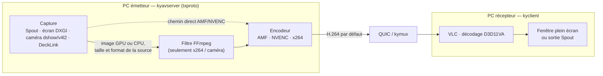
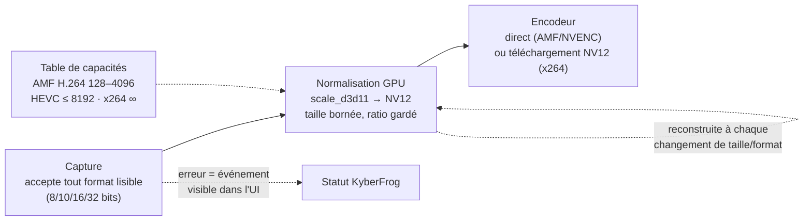

# Résolutions et formats d'image, de la source au récepteur — audit (tour 1)

*Étude, pas de code. Point de départ : un projet TouchDesigner qui sort en
Spout à une résolution « custom » n'arrive jamais au récepteur, et une entrée
HDMI sur une DeckLink non plus. Question posée : d'où viennent ces blocages, et
comment corriger par une architecture plutôt que par des rustines.*

*Tour 1 — 2026-09-28. Fork lu au pin `kyber-desktop` `3455934`
(`txproto` `15d03e1`, `kymedia` `d1b955d`, FFmpeg n8.1). Tests sur le PC de dev
(RX 7800 XT, pilote AMF, ffmpeg du bundle).*

Légende : **constaté** (lu dans le code ou mesuré), **déduit** (la lecture ne
laisse guère de doute, pas encore reproduit), **à confirmer**.

## En bref

- **Personne ne négocie la taille ni le format.** La source impose les siens,
  l'encodeur s'ouvre sur la première image reçue, le récepteur décode ce qui
  arrive. Aucune étape ne ramène l'image à ce que l'encodeur sait prendre.
- **Le blocage le plus probable côté TD n'est pas la résolution mais le format
  de pixel.** La capture Spout n'accepte que le RGBA/BGRA 8 bits ; tout autre
  format (10 bits, 16 ou 32 bits flottant) boucle en silence. C'est **constaté**
  dans tes logs : « UE Test » (Unreal, 2038×782) a répété
  `Unsupported sender texture format: 24` 327 fois le 2026-08-21 sans jamais
  envoyer une image. Le Spout Out TOP de TD partage par défaut le format de son
  entrée, et deux Kinect TOP du projet sont en `rgba16float`.
- **L'encodeur AMF H.264 a une plage de 128 à 4096 px par côté** (constaté).
  Hors plage, KyberFrog bascule seul sur x264 — ça marche, mais x264 ne tient
  plus 60 fps au-delà de la 4K environ.
- **Un changement de taille en cours de flux gèle le transmetteur** sur les
  chemins qui passent par un filtre (x264, caméras) : l'encodeur se recrée, le
  filtre non. C'est la cause probable de la limite connue de #8.
- **Les erreurs de capture sont muettes** : le transmetteur reste « Running »,
  le viewer reste noir, et le repli x264 ne se déclenche pas.
- **DeckLink sous Windows n'est pas supporté du tout** (pas un problème de
  résolution) → nouvelle carte #52. Sous Linux, la carte ne reconnaît que les
  modes broadcast : une sortie PC à résolution « PC » n'accroche pas.

## 1. Le chemin d'une image



Aucune boîte ne choisit une taille. Le seul redimensionnement du code est
Linux-only et forcé à 1920 de large (`scale=w=1920:h=-1`, #33,
`kymedia` `kyavservice/src/txproto/video.rs:645`). Le codec est choisi par le
**client** (`--video-codec`, défaut `h264`, `kyclient/src/main.rs:212-216`) et
KyberFrog ne le règle pas. L'encodeur est choisi par la **marque du GPU**
(`shared/src/encoder.rs`), jamais en fonction de la source.

## 2. Constats

### C1 — Spout : quatre formats 8 bits acceptés, tout le reste boucle en silence

**Constaté.** `txproto` `src/iosys_spout.c:145-160` ne traduit que
`B8G8R8A8_*` et `R8G8B8A8_*` (plus le 0 historique). Tout autre format :
`bind_shared_texture()` logue `Unsupported sender texture format: N`
(`:713-720`) et la boucle de capture réessaie toutes les 100 ms, **indéfiniment
et sans événement d'erreur** (`:817-822`).

| Format DXGI | N° dans le log | Qui l'envoie | Accepté ? |
|---|---|---|---|
| `B8G8R8A8_UNORM` | 87 | Resolume, OBS | oui |
| `R8G8B8A8_UNORM` | 28 | TD 8 bits fixe | oui |
| `R10G10B10A2_UNORM` | 24 | Unreal (constaté), TD 10 bits | **non** |
| `R16G16B16A16_FLOAT` | 10 | TD 16 bits float | **non** |
| `R32G32B32A32_FLOAT` | 2 | TD 32 bits float | **non** |
| formats mono (`R8`, `R16`…) | 61, 56… | TD mono, si Spout les partage | **non** (à confirmer côté TD) |

TouchDesigner : le paramètre *Pixel Format* du Spout Out TOP vaut « Use Input »
par défaut, et « Spout can send textures in various pixel formats up to and
including 32-bit float RGBA »
([doc Derivative](https://docs.derivative.ca/Syphon_Spout_Out_TOP)). Le format
dépend donc de toute la chaîne de TOP en amont.

Preuve dans les logs du PC de dev (`instances/ue-test/kycontroller.log`) :
sender « UE Test » 2038×782 enregistré, encodeur x264 créé, puis 327 lignes
`Unsupported sender texture format: 24` et aucune image.

### C2 — AMF H.264 : de 128 à 4096 px par côté

**Constaté** sur la RX 7800 XT, avec le ffmpeg du bundle, en reproduisant le
chemin Kyber (images D3D11 BGRA → `h264_amf`, `ultralowlatency`, `bf=0`) :

| Taille | h264_amf | hevc_amf | libx264 |
|---|---|---|---|
| 1920×1080, 2038×782, 3000×1000 | ok | ok | ok |
| impaires (1279×719, 1281×720, 1920×1081) | ok | ok | ok |
| 3840×2160, 4096×2304, 1080×4096 | ok | ok | ok |
| 4098×1080 … 8192×1080 (triple HD, ultra-large) | **échec** `Init() failed with error 5` | ok (≤ 8192) | ok |
| 1920×4352 | **échec** | ok | ok |
| < 128 px sur un côté (80×60, 160×90, 1920×100) | **échec** | **échec** | ok |

Les tailles impaires ne posent **aucun** problème, contrairement à l'intuition.
NVENC n'a pas pu être testé ici (pas de GPU NVIDIA) : sa limite H.264 documentée
est 4096×4096, **à confirmer**.

Hors plage, la ligne `ERROR txproto::lavc:h264_amf …` déclenche le repli
KyberFrog vers x264 (`shared/src/encoder.rs:143`,
`kyberfrog/src/supervisor.rs:782`). Le flux finit donc par passer — sur le CPU.

### C3 — Le repli x264 ne tient pas 60 fps en très grand

**Constaté, mesure pessimiste** (le générateur de test et l'upload GPU sont
comptés dans le temps). Chaîne proche de Kyber : téléchargement BGRA,
conversion CPU vers NV12, x264 `ultrafast` sur 2 threads — ce que txproto impose
(`src/encode.c:89`) tant que `encoder_threads` n'est pas réglé.

| Taille | chaîne actuelle | conversion NV12 sur GPU puis téléchargement |
|---|---|---|
| 1920×1080 | 148 fps | — |
| 3840×2160 | 24 fps | 32 fps |
| 5760×1080 | 32 fps | 44 fps |
| 7680×1080 | 32 fps | — |

Pour mémoire, x264 coûtait ~26 ms de latence contre ~4 ms pour AMF au banc #28.

### C4 — Changement de taille à chaud : l'encodeur suit, le filtre non

**Constaté pour l'encodeur, déduit pour le gel.** L'encodeur compare chaque
image à sa configuration et se recrée si la taille change
(`src/encode.c:598-607`, `:639`, `:653`). Le graphe de filtre, lui, est
configuré **une fois**, sur la première image (`src/filter.c:403-454`), et
jamais reconstruit. Or ce filtre existe sur deux chemins :

- **x264** : `hwdownload,format=bgra,format=nv12` (`video.rs:635`) — le
  téléchargement garde la taille du premier pool de textures ;
- **caméra → AMF/NVENC** : `format=nv12` avant l'encodeur (`video.rs:277`).

Seul le chemin direct Spout/écran → AMF suit un changement de taille. C'est la
cause probable de la limite connue de #8 (« the transmitter freezes and needs a
manual restart when the captured screen changes resolution mid-stream ») et de
la limite notée dans [plan-spout-passthrough](plan-spout-passthrough.md#limites-connues).
À reproduire au tour 2 (TD sait changer sa résolution en direct).
Accessoirement, un changement de **format** seul (BGRA ↔ RGBA) n'est pas
détecté (`video_config_changed` ne regarde que taille et rotation).

### C5 — Les erreurs de capture ne remontent pas

**Constaté.** Trois échecs de capture ne produisent aucun événement d'erreur
vers kyavservice :

- Spout, format refusé ou `OpenSharedResource()` en échec (PC multi-GPU) :
  boucle de réessai (`iosys_spout.c:817-822`) ;
- caméra/DeckLink, `av_read_frame` en erreur : le thread s'arrête sur
  `goto end` (`src/iosys_lavd.c:108-109`), sans `SP_EVENT_ON_ERROR` ;
- côté KyberFrog, le détecteur ne reconnaît que les erreurs d'**encodeur
  matériel** (`txproto::lavc:*_amf|_nvenc|_qsv|_vaapi`), pas `txproto::spout`.

Résultat : transmetteur « Running », viewer noir. Et si aucune image n'arrive
dans les 5 s, la session est perdue pour de bon (#51, `OUTPUT_READY_TIMEOUT`).

### C6 — DeckLink

**Windows — non supporté (constaté).** Le ffmpeg du bundle Windows n'est pas
compilé avec `--enable-decklink` (voir `ffmpeg -version`), et la carte vue par
DirectShow (« Decklink Video Capture ») s'annonce en `(none)`, que
`kyberfrog/src/cameras.rs` écarte (seuls les `(video)` sont gardés). La carte
n'apparaît donc nulle part. → **#52**.

**Linux (#47)** — le démuxeur FFmpeg (`libavdevice/decklink_dec.cpp`) :

- sans `format_code`, détecte le mode pendant **3 s maximum** (`:1049-1057`),
  sinon `Cannot Autodetect input stream or No signal` et l'ouverture échoue
  (`:1211-1215`) ;
- la carte ne reconnaît que des **modes broadcast** (720p, 1080i, 1080p, 2K/4K
  selon le modèle) : une sortie PC en 1920×1200, 1280×1024 ou résolution custom
  n'accroche pas (fiches Blackmagic, aucune résolution PC listée) ;
- le 1080p50/60 dépend du modèle : listé pour les Mini Recorder HD et 4K
  ([tech specs](https://www.blackmagicdesign.com/products/decklink/techspecs)),
  **à confirmer** pour la Mini Recorder d'origine de Romain ;
- un changement de mode en cours de flux est seulement noté
  (`VideoInputFormatChanged`, `:1015-1025`), le flux n'est pas rouvert → gel
  (déduit).

### C7 — Côté récepteur

**Constaté sur ce PC** : le décodage H.264 D3D11VA de la RX 7800 XT passe
jusqu'en 8192×4320 (test ffmpeg, même API que VLC). **À confirmer** sur les PC
récepteurs réels : un iGPU Intel plafonne souvent à 4096×2304 en H.264, et VLC
retombe alors en décodage logiciel (déduit). La sortie Spout du viewer suit la
taille native du flux ([plan-spout-zerocopy](plan-spout-zerocopy.md)).

## 3. Tes deux cas, relus

**TD en Spout, résolution inconnue.** Une seule ligne de
`%APPDATA%\kyberfrog\instances\<transmetteur>\kycontroller.log` tranche :

| Ligne dans le log | Hypothèse |
|---|---|
| `Spout: New sender registered: "<nom>" (L×H)` | donne **la résolution** que tu cherches |
| `Unsupported sender texture format: N` | C1, format de pixel (le plus probable) |
| `h264_amf … Init() failed with error 5` puis relance | C2, taille hors plage AMF → repli x264 |
| `Configuration change detected: L×H` puis plus rien | C4, changement de taille à chaud |
| `OpenSharedResource() failed` | TD et KyberFrog sur deux GPU différents |

Dans `Kinect-Cam_NDI-Spout.toe`, le sender `kinect-contour` descend d'un Kinect
TOP `playerindex` en **80×60** : sous le minimum AMF (repli x264 attendu), et au
format de pixel hérité en cascade, illisible sans TD lancé.

**HDMI → DeckLink.** Sous Windows : non supporté (#52). Sous Linux : vérifier
que la source sort un mode broadcast (1080p50/60 selon le modèle), pas une
résolution PC.

## 4. Piste de ré-architecture (esquisse, à arbitrer)

L'idée : **une étape de normalisation explicite entre la capture et
l'encodeur**, pilotée par ce que l'encodeur choisi sait prendre.



Briques déjà vérifiées sur ce PC avec le FFmpeg 8.1 du bundle :

- `scale_d3d11=width=…:height=…:format=nv12` convertit et réduit sur le GPU
  (BGRA 5760×1080 → NV12 3840×720 → `h264_amf` : ok) ;
- AMF accepte en entrée `x2bgr10` (= format 24 d'Unreal) : ok ; FFmpeg déclare
  aussi `rgbaf16` (= TD 16 bits float), **non testable** au ffmpeg en ligne de
  commande ;
- la même conversion GPU sert x264 : 2,7× moins d'octets à télécharger (c'est
  aussi l'item B3 de [plan-latency](plan-latency.md)).

Ce que ça règle : C1 (tout format lisible entre), C2 et C3 (la taille est
bornée avant l'encodeur, ou HEVC choisi), C4 (graphe reconstruit à chaque
changement), C5 (erreurs remontées). Où ça vit : `kymedia` `video.rs`
(construction du graphe), `txproto` `filter.c` (reconfiguration),
`iosys_spout.c` (table des formats), KyberFrog (statut, choix encodeur/codec).

Décisions ouvertes : que faire d'une source trop grande (réduire ou passer en
HEVC, qui exige des récepteurs compatibles), et qui porte le changement de
codec (le client le demande aujourd'hui).

## 5. Pas vérifié à ce tour

- Le format réel du Spout de ton projet TD : il faut TD lancé (et la Kinect).
- `rgbaf16` dans AMF : ffmpeg ne sait pas générer ce format pour le test.
- NVENC : pas de GPU NVIDIA ici.
- DeckLink : pas de carte sur ce PC.
- Le gel au redimensionnement de bout en bout : il faut un sender qui change
  de taille en direct (TD fait l'affaire).
- VLC : ses propres limites de décodage matériel, lues seulement via ffmpeg.

## Annexe — reproduire les mesures

Avec le ffmpeg du bundle (`<install>\ffmpeg.exe`), depuis Git Bash :

```sh
FF=ffmpeg.exe; H="-init_hw_device d3d11va=d3d -filter_hw_device d3d"
# chemin Spout/écran → AMF
$FF $H -f lavfi -i testsrc2=s=5760x1080:r=60 -vf format=bgra,hwupload \
    -c:v h264_amf -usage ultralowlatency -bf 0 -frames:v 10 -f null -
# normalisation GPU puis AMF
$FF $H -f lavfi -i testsrc2=s=5760x1080:r=60 \
    -vf format=bgra,hwupload,scale_d3d11=width=3840:height=720:format=nv12 \
    -c:v h264_amf -frames:v 10 -f null -
```
