# Banc de mesure de latence KyberFrog vs NDI — Phase A (#28-4)

*Étude du 2026-09-13. Aucune ligne de code écrite dans la chaîne : ce document
est le plan, la cartographie qui le justifie, la spec des instruments, et le
résultat d'un smoke test exécuté le jour même (§ 0). Il complète
[plan-latency.md](plan-latency.md) (les leviers) par la question préalable :
**comment mesurer sans se tromper**.*

> **Branche.** `feat/bench-latency-phase-a` est empilée sur
> `feat/backlog-reorg` (qui porte `plan-latency.md`, absent de `dev`) et encore
> en développement. **Ne pas merger** : rebaser sur `feat/backlog-reorg` quand
> celle-ci bouge, puis sur `dev` une fois qu'elle y est.

## TL;DR

1. **La question bloquante a une réponse positive — lue dans le code, puis
   constatée à l'exécution.** La sortie Spout de kyclient est câblée de bout en
   bout (§ 2.3) ; le 2026-09-13 un `kyclient --spout-out` a publié son sender à
   **59,5 fps** en zero-copy D3D11 (§ 0). Pas de fallback capture d'écran : le
   banc mesure **Spout → Spout**, sur la même frontière pour KyberFrog et NDI.
2. **L'instrumentation interne existe déjà et elle est riche** : dix horodatages
   par frame, clés par PTS, de la capture Spout jusqu'à la publication Spout de
   sortie (§ 3). Le binaire `kyclient --metrics true` les écrit dans
   `metrics.json` — **97,4 % de frames complètes, aucune métrique perdue**
   pendant le smoke test. KyberFrog ne passe pas le flag.
3. **Sur une seule machine, tout le monde parle le même temps** — QPC en
   microsecondes côté kyproto, VLC et txproto, **confirmé** par la config du
   build FFmpeg et par un offset clock-sync mesuré ≤ 19 µs (§ 0, § 3.3).
4. **Phase A ne demande quasiment aucun code dans la chaîne de forks.** Le
   travail est un instrument externe (`kybench`, Rust) + un orchestrateur et une
   analyse (Python). La seule instrumentation fork envisagée est
   **conditionnelle** (étape 10).
5. **Trois pièges trouvés dans le code**, qui fausseraient une mesure naïve :
   métriques jetées silencieusement quand un canal est plein (§ 3.4), métriques
   serveur réservées au *premier* client (§ 3.4), et `received` qui ne date pas
   l'arrivée QUIC mais la lecture du socket local par VLC (§ 3.2).
6. **Le smoke test a ajouté trois constats** : l'installeur v0.5.0 déployé sur
   le poste **n'embarque pas** le zero-copy (seul le bundle `KyberFrog-test` l'a),
   QUIC signale **~30 paquets perdus/s en boucle locale** côté serveur, et les
   ~6 premières secondes d'une session sortent avec **4 à 6 s de retard**
   (backlog de démarrage) — § 0.

---

## 0. Vérifications exécutées (2026-09-13)

Faites dans la foulée de l'étude, parce qu'elles transformaient les deux
affirmations dont tout le plan dépend (sortie Spout, domaine d'horloge) en
constats, pour quelques minutes et zéro code.

### 0.1 Ce qui a été lancé

Instance isolée, sans toucher à la config de l'opérateur : `kycontroller` du
bundle `C:\Users\trist\KyberFrog-test` sur le port **9150** avec un
`kyber_config.toml` de scratch (x264, auth transparente, source **écran**
2560 × 1440 — aucun sender Spout source n'était actif), puis

```
kyclient --port 9150 --tls-skip-verification --auth-username vj --auth-password kyberfrog \
         --spout-out kybench-smoke --inputs false --audio false --keyboard-grab false \
         --metrics true 127.0.0.1
```

~2 min 30 de flux, puis arrêt ; seuls les processus de l'opérateur restaient.
Révisions lues dans les logs : kyclient `0.27.1-8-gd2c418d`, kycontroller
`0.27.0-6-ge303633`.

### 0.2 Résultats

| Vérification | Résultat | Statut |
|---|---|---|
| Sender Spout de sortie enregistré | `kybench-smoke` présent dans `SpoutSenderNames` | **constaté** |
| Chemin de sortie | log : `Spout output enabled (D3D11 zero-copy)`, décodage `D3D11VA` sur la RX 7800 XT | **constaté** |
| Cadence publiée | sémaphore compteur : **59,5 frames/s** | **constaté** |
| Domaine d'horloge | FFmpeg 8.1 compilé `HAVE_CLOCK_GETTIME 0` → `av_gettime_relative_win32()` = QPC µs (même formule que kyproto) ; offset clock-sync mesuré entre −19 et +19 µs sur 17 échantillons ; **0 segment négatif** sur 9 141 frames | **constaté** |
| Complétude des métriques | 9 141 frames complètes / 9 387 acquises (**97,4 %**) ; 0 `Channel full`, 0 `Metric discarded`, 0 `Failed to send Metrics` | **constaté** (à 2560 × 1440 / 60 fps) |
| Doublons de PTS | aucun | **constaté** |

Décomposition en **régime établi** (après 10 s, 8 790 frames), source écran
2560 × 1440, x264 — **indicatif, pas un résultat Phase A** (ni Spout, ni 1080p) :

| Segment | p50 ms | p95 ms | p99 ms | max ms |
|---|---:|---:|---:|---:|
| acquired → encoding (hwdownload + conversion) | 4,13 | 5,82 | 7,03 | 14,7 |
| encoding → encoded (**x264**) | **21,16** | 25,22 | 31,80 | 43,3 |
| encoded → sent | 0,05 | 0,11 | 0,17 | 2,4 |
| sent → received (kycom + kydup + QUIC + kycom) | 0,24 | 0,52 | 9,07 | 44,7 |
| received → decoding | 0,02 | 0,03 | 20,20 | 39,7 |
| decoding → decoded | 0,19 | 0,43 | 3,61 | 33,5 |
| decoded → prepared (rendu dans la texture Spout) | 3,66 | 3,90 | 4,45 | 38,3 |
| prepared → displayed | 0,02 | 0,04 | 0,11 | 1,2 |
| **acquired → displayed** | **29,46** | **36,51** | **80,06** | 122,4 |

### 0.3 Ce que ça change

- **L'encodeur fait 72 % de la médiane.** Le transport loopback est négligeable
  en médiane (0,24 ms) : l'étape 10 (découpe du transport) a peu de chances de
  se déclencher sur la médiane — mais voir la queue ci-dessous.
- **La queue (p99 80 ms) vient du transport et de l'entrée VLC**, pas de
  l'encodeur. En parallèle, `network_remote.packets_lost` (vu du serveur) monte
  **régulièrement de ~30/s** (4 939 en 160 s) en boucle locale, alors que le client en voit 0.
  Hypothèse (déduite, non vérifiée) : débordement du buffer de réception UDP
  côté kyclient ou détection de perte parasite de quinn ; en mode `Reliable`,
  chaque perte coûte une retransmission. **Ajout au plan** : corréler pertes et
  pics de `sent → received` à l'étape 4.
- **Backlog de démarrage** : sur les 10 premières secondes, `acquired →
  displayed` atteint p95 6,1 s (frames encodées avant que le client soit prêt,
  `Dropping filtered frame` dans le log kyavserver). Le préchauffage de 60 s du
  protocole est justifié par la mesure ; c'est aussi une piste produit
  ([plan-latency.md](plan-latency.md), pistes du banc).
- **Bundle à mesurer** : l'installeur **v0.5.0 installé dans
  `C:\Program Files\KyberFrog` n'a pas le zero-copy** (chaîne `D3D11 zero-copy`
  absente de son `kyclient.dll`, binaires du 09/07) ; `KyberFrog-test` l'a
  (`kyclient.dll` du 18/07) mais c'est un **bundle mixte** (kycontroller 09/07,
  kyavserver 15/07). Le contenu de l'installeur v0.5.1 n'est pas vérifié. →
  étape 0 : construire un bundle cohérent aux SHAs `kyberfrog-dev`.
- **Logs kyclient partagés** : tous les kyclient écrivent dans
  `%LOCALAPPDATA%\Kyber\log\kyclient.log` (sans PID dans les lignes), et
  ignorent `KYBER_LOG_DIR`. Le viewer KyberFrog de l'opérateur y écrivait en
  même temps (reconnexion toutes les 15 s vers `192.168.1.15:9000`). →
  condition figée : **KyberFrog arrêté pendant les runs**.
- **Piège CLI** : `--metrics` attend `true`/`false`, le serveur reste
  positionnel en dernier.

---

## 1. Cartographie des branches (révisions lues)

Le code a été lu sur les **têtes d'intégration**, pas sur les worktrees locaux
(plusieurs sont désynchronisés de leur gitlink — `kyctl` est checkouté sur une
vieille `dev`). Snapshot extrait par `git archive` :

| Repo | Révision lue | Branche vivante |
|---|---|---|
| kyber-desktop | `origin/kyberfrog-dev` (2026-08-17) | `kyberfrog-dev` |
| kysdk | `6a92a38` | `kyberfrog-dev` |
| kyctl | `b29f8f4` (zero-copy Spout par défaut) | `kyberfrog-dev` |
| kymedia | `7f0360f` | `kyberfrog-dev` |
| txproto | `12f1e1f` | `kyberfrog-dev` |
| vlc-rs | `bfb68fc` | `kyberfrog-dev` |
| vlc (upstream kyber.stream, non forké) | `dd2db54` — lu dans le checkout de WS1, même SHA | — |
| kymux / kyproto (upstream, non forké) | `831d312` | — |
| kyberfrog | `origin/dev` `2e13d5f` | `dev` |

**Aucune branche ne touche à l'instrumentation ou à la latence.** Écarts
notables (`behind/ahead` contre la branche vivante) :

| Branche | Écart | Ce qui compte pour le banc |
|---|---|---|
| kyctl `KF-cast/player-external` | 66 / 11 | pré-rebase 0.27.1 → **cherry-pick only**. Porte `7e0fb8e` « don't panic when a host offers no metrics endpoints » : le `unwrap()` existe toujours sur `kyberfrog-dev` (`kyclient/src/kymux_backend/mod.rs:345-349`). **Sans effet en Phase A** (kycontroller offre les deux endpoints dès que `metrics: true`), mais à rapatrier si un émetteur tiers (kyberfrog-cast) est un jour mesuré. Porte aussi `d1a3cca` (kycontroller en bibliothèque) et `12b9ce0` (backend AV in-process) — voir § 2.4. |
| kyctl `feat/spout-zerocopy` | 3 / 0 | contenu inclus dans `kyberfrog-dev`, supprimable |
| kyber-desktop `fix/*-0.27` | 12 / 1 | bugfixes d'input, hors sujet |
| kyberfrog `feat/linux-support` | 1 / 0 | déjà mergée dans `dev` |
| kyberfrog `feat/backlog-reorg` | 0 / 13 | **base de cette branche d'étude** (porte `plan-latency.md`, absent de `dev`) |

---

## 2. Chemin d'une frame, fonction par fonction

```mermaid
flowchart LR
  subgraph S["kyavserver (processus 1)"]
    A["iosys_spout.c<br/>spout_capture_thread<br/><b>acquired</b>"] --> B["filtergraph x264<br/>hwdownload,format=nv12"]
    B --> C["encode.c<br/><b>encoding</b> / <b>encoded</b>"]
    C --> D["packet_sink.c<br/>en-tête kymux (PTS)<br/><b>sent</b>"]
  end
  subgraph K["kycontroller (processus 2)"]
    E["kycom (local)"] --> F["kydup<br/>(mode Multi, défaut)"] --> G["kyproto video endpoint<br/>Reliable (défaut)"]
  end
  subgraph R["kyclient (processus 3)"]
    H["kyproto recv"] --> I["kycom (local)"] --> J["VLC access kymux.c<br/><b>received</b>"]
    J --> L["decoder.c<br/><b>decoding</b> / <b>decoded</b>"]
    L --> M["video_output.c Thread0Latency<br/><b>prepared</b> → display → <b>displayed</b>"]
    M --> N["kyspout end_frame<br/>Flush + sémaphore Spout"]
  end
  D --> E
  G -- "QUIC loopback" --> H
```



### 2.1 Émission

| # | Étape | Où (révision § 1) | Notes pour la mesure |
|---|---|---|---|
| 1 | Configuration | `kyberfrog/shared/src/gen.rs` `render_config()` | pose `spout_sender`, encodeur `x264` par défaut (`gen.rs:74`) |
| 2 | Choix du backend | `kyavservice/src/video.rs` `configure()` → `windows_streaming_api_list()` | Spout épinglé → seul `spout` est chargé |
| 3 | Capture Spout | `txproto/src/iosys_spout.c:786` `spout_capture_thread` | **scrute** le sémaphore compteur toutes les ~0,5 ms (`av_usleep(500)`, l. 838) ; sans compteur, cadence fixe 16,7 ms. Copie GPU `CopySubresourceRegion` + `Flush` **puis** horodate `acquired` (l. 906-919) |
| 4 | Téléchargement + conversion | `video.rs:540` `create_x264` : `hwdownload,format=bgra,format=nv12` | aucun horodatage entre `acquired` et `encoding` |
| 5 | Encodage | `txproto/src/encode.c:706` (`encoding`, avant `avcodec_send_frame`) et `:775` (`encoded`, après `receive_packet`) | `preset=ultrafast tune=zerolatency x264-params=force-cfr=0` (« 1 à 2 frames de latence » selon le commentaire l. 579-582) |
| 6 | Sortie paquet | `txproto/src/packet_sink.c:184-213` | en-tête 12 octets : **PTS µs sur 61 bits** + flags ; `sent` après `net_send_all` vers le kycom **local** de kycontroller |

La PTS naît à la capture (`ts - epoch`, base `AV_TIME_BASE_Q`), traverse le
filtre et l'encodeur sans rééchelonnement (`encode.c:87`, `filter.c:601`), et
voyage dans l'en-tête kymux jusqu'à VLC. **C'est l'identifiant de frame interne,
de bout en bout.**

### 2.2 Transport (kycontroller)

- `kycontroller/src/kymux_controller/mod.rs:286` `start_video` : en mode
  **Multi** (défaut, `config.rs:116` — `multi_client` absent ⇒ `true`) le flux
  passe par **kydup** ; en **Mono** l'avservice écrit directement dans l'endpoint
  client via kycom.
- `kydup.rs` : broadcast de 32 paquets, **backpressure globale à 20** — le
  client le plus lent freine l'encodeur. Sur un banc à un récepteur, c'est
  neutre ; à surveiller dès qu'un second client se connecte.
- Protocole vidéo : `Reliable` par défaut côté kyclient
  (`kyber-desktop/kyclient/src/main.rs`, `--kymux-video`).

### 2.3 Réception et sortie Spout — **réponse à la question bloquante**

**Oui, la sortie Spout est opérationnelle**, preuve par le code, maillon par
maillon :

| Maillon | Fichier |
|---|---|
| KyberFrog émet `--spout-out <nom>` (et retire `--fullscreen`) | `kyberfrog/shared/src/config.rs:477-481` |
| kyclient bascule en mode sans fenêtre, fixe le display id | `kyber-desktop/kyclient/src/event_loop.rs:344-352`, `:396-405` |
| Config player → C-API | `event_loop.rs:494-501` → `kyclient-rs/src/lib.rs:656` `set_spout_out` → `kyclient/src/capi.rs:895` |
| Backend kymux desktop → player | `kyclient/src/kymux_backend/desktop.rs:77` |
| Le player route vers Spout au lieu d'une fenêtre | `kyvlcplayer/src/player.rs:521-523` |
| **Zero-copy D3D11 par défaut** (`KYSPOUT_SMEM=1` = chemin CPU) | `player.rs:195-204`, `:225-303` |
| libVLC rend dans la texture partagée ; `swap` → `end_frame` : `Flush` + libère le mutex + **incrémente le sémaphore compteur** | `kyspout/src/lib.rs:354-362` |

Validé E2E matériel le 2026-07-18 (Resolume/TouchDesigner, voir
[plan-spout-zerocopy.md](plan-spout-zerocopy.md)) et contenu dans la chaîne
`kyberfrog-dev` épinglée depuis le 2026-08-17. **Re-constaté le 2026-09-13**
avec le bundle `KyberFrog-test` (§ 0) — mais **absent de l'installeur v0.5.0**
installé sur le poste : le bundle mesuré doit être choisi, pas supposé.

Conséquences directes pour le banc :

- **Le compteur Spout est publié** → une sonde peut détecter chaque nouvelle
  frame sans heuristique (même protocole que `iosys_spout.c:766`).
- **`displayed` est horodaté *après* `vd->ops->display`** (`vlc
  src/video_output/video_output.c:2075`), c'est-à-dire après `end_frame`. C'est
  donc l'heure de publication Spout, vue de l'intérieur — et un point de
  recoupement idéal avec la sonde externe (étape 4).
- Réserve : `Flush` ne garantit pas que le GPU a fini. L'écart
  `sonde − displayed` le mesure.

### 2.4 Rôles réels et état de l'unification serveur/client

| Binaire | Rôle réel aujourd'hui | Processus |
|---|---|---|
| `kyberfrog` | superviseur **unique** des deux rôles, web UI, tray — ne linke aucun crate du fork | 1 |
| `kycontroller` | session, auth, TLS, QUIC (kyproto), kydup, relais métriques, clock-sync ; spawne kyavserver | 1 par émetteur |
| `kyavserver` | pipeline média (txproto/FFmpeg) : capture → encodage → socket kycom local | 1 par session/flux |
| `kyclient` | client QUIC + kycom local + libVLC **in-process** (décodage, rendu, sortie Spout) | 1 par viewer |

**L'unification est faite au niveau orchestration, pas au niveau processus.**
« Une app, deux rôles » (Amélioration 1) est livré : un superviseur, une UI, un
TOML. Mais la chaîne reste **trois processus et deux sauts kycom locaux par
flux**. La seule unification in-process existante vit sur la branche kyctl
`KF-cast/player-external` (kycontroller en bibliothèque, backend AV pluggable),
**pré-rebase, 66 commits de retard**, pour kyberfrog-cast (Android). Les options
de rupture (γ/δ) sont dans [archi-greenfield.md](archi-greenfield.md), non
arbitrées (#24).

**Pour le banc :** Phase A mesure les binaires tels que livrés, lancés
directement (sans le superviseur, qui ne sait pas passer `--metrics`), avec le
`kyber_config.toml` que KyberFrog génère. Aucun impact de latence attendu du
superviseur : il ne voit pas passer les frames.

**Cohabitation de ports :** kycontroller et kyclient allouent tous deux leur
kycom dans `9090..9100` (`desktop.rs:201`). Deux processus sur une machine :
aucun souci, mais ne pas lancer d'autres instances pendant un run.

---

## 3. Instrumentation existante

### 3.1 Les dix horodatages par frame

| Clé | Émis par | Moment |
|---|---|---|
| `acquired` | txproto `iosys_spout.c:919` | copie GPU du sender terminée (après détection) |
| `encoding` | txproto `encode.c:706` | frame remise à l'encodeur |
| `encoded` | txproto `encode.c:775` | paquet sorti de l'encodeur |
| `sent` | txproto `packet_sink.c:210` | paquet écrit dans le socket kycom local |
| `received` | VLC `modules/access/kymux.c:310/405` | **VLC a lu le bloc sur son socket kycom local** |
| `decoding` | VLC `src/input/decoder.c:1808` | bloc remis au décodeur |
| `decoded` | VLC `decoder.c:1570` | image décodée |
| `skipped` | VLC `src/video_output/pic_buf.c:81` | remplacée avant affichage (mode 0-latence) |
| `prepared` | VLC `video_output.c:2062` | après `prepare` |
| `displayed` | VLC `video_output.c:2075` | après `display` (= publication Spout) |

Flux : txproto → `kyavservice/src/metrics.rs:50` (msgpack sur kycom) →
kycontroller (endpoint métriques, *claim-once*) → kyclient
`kymux_backend/metrics.rs:144` → `Metric::Video` → `kyber-desktop/kyclient/src/metrics.rs:36`
écrit **`metrics.json` dans le répertoire courant**, en JSON brut (une ligne
par événement, non consolidé). Le consolidateur `MetricsConsolidator`
(`kyclient/src/metrics.rs`) existe mais **n'est pas branché** par le binaire —
tant mieux : il `assert!`e sur les doublons. La consolidation se fera hors ligne.

Métriques réseau en plus : `network_local` (RTT, pertes, toutes les 5 s),
`network_remote` (vu du serveur, 5 s), `network_ping` (clock-sync, offset et
délai, toutes les 10 s, moyenne de 3).

### 3.2 Ce qui manque, et où

| Trou | Pourquoi ça compte | Qui le comble |
|---|---|---|
| Publication du sender **source** | aucun horodatage avant `acquired` | `kybench` (générateur) |
| Détection de la frame **en sortie**, lue par un tiers | c'est la seule mesure identique pour NDI | `kybench` (sonde) |
| Identifiant de frame **dans les pixels** | NDI ne transporte pas la PTS Kyber | `kybench` (codec d'ID) |
| Entre `acquired` et `encoding` | `hwdownload` + conversion non isolés | déduit (`encoding − acquired`), suffisant en Phase A |
| **Entre `sent` et `received`** | ce segment agrège kycom serveur, kydup, kyproto, QUIC, kyproto client, kycom client — **`received` n'est pas l'arrivée QUIC** | conditionnel, étape 10 (fork) |

### 3.3 Domaines d'horloge

| Composant | Horloge (Windows) | Source |
|---|---|---|
| kyproto (clock-sync) | `QueryPerformanceCounter` → µs | `kyproto/src/clock.rs:34` |
| VLC | `mdate_perf` = QPC → µs | `vlc src/win32/thread.c:500` |
| txproto | `av_gettime_relative()` → `av_gettime_relative_win32()` = `counter × 10⁶ / freq` | **constaté** : FFmpeg 8.1 du build (`builddir-win32-server/subprojects/FFmpeg-n8.1/build/config.h`, idem WS1) a `HAVE_CLOCK_GETTIME 0`, donc branche `_WIN32` de `libavutil/time.c` |

Les trois sont QPC en µs : sur une machine l'`offset` clock-sync vaut ≈ 0
(mesuré ±19 µs, § 0) et les horodatages bruts sont directement comparables à
ceux de `kybench`, qui lira QPC aussi. La porte de l'étape 4 reste, pour
re-vérifier sur le bundle réellement mesuré.

`av_usleep(500)` (scrutation Spout, `iosys_spout.c:838`) passe par `usleep` de
MinGW (`HAVE_USLEEP 1`), qui fait `Sleep(usec / 1000)` = **`Sleep(0)`** —
déduit de la CRT MinGW, non constaté : la boucle cède la main sans dormir et
peut occuper un cœur par émetteur Spout. Le smoke test utilisait une source
écran, il ne tranche pas ; l'étape 4 relève le CPU de kyavserver en source Spout. `clock_type = "system"`
(`kyavservice/src/config.rs:145`) ne change que l'epoch de la PTS, pas l'horloge
des métriques.

### 3.4 Effets observateur et pertes silencieuses

| Constat | Où | Conséquence |
|---|---|---|
| txproto → forwarder : `try_send` sur un canal de 32 | `kyavservice/src/metrics.rs:62` | métriques serveur jetées sous charge (log `Failed to send Metrics`) |
| Player → bus de messages kyclient : `try_send` sur un canal de **32**, `Channel full: message dropped` | `kyclient/src/message_bus.rs:138-146`, `:208` | ~300 métriques/s à 60 fps ; le **même** bus porte les messages de contrôle |
| Bus → collecteur : `try_send` sur 1024 | `kyclient/src/lib.rs:806` | `Metric discarded` |
| Métriques serveur **réservées au premier client** qui les demande (mode Multi) | `kycontroller/src/kymux_controller/mod.rs:399-441` | un second client (preview, test) vole les métriques |
| Écriture JSON synchrone dans un `BufWriter` depuis le callback | `kyber-desktop/kyclient/src/metrics.rs` | coût à mesurer (porte « overhead `--metrics` », étape 4) |

**Règle du banc :** le chiffre de tête (latence Spout → Spout) ne dépend
**jamais** des métriques internes. Elles servent à la décomposition, avec un
taux de complétude publié.

---

## 4. Principes du banc

### 4.1 Frontière de mesure unique

```
t_pub(n)  : kybench publie la frame n sur le sender SOURCE (QPC, après ReleaseSemaphore)
t_out(n)  : kybench détecte et décode l'ID n sur le sender de SORTIE (QPC)
latence(n) = t_out(n) − t_pub(n)
```

Même générateur, même sonde, même frontière pour les trois configurations :

| Config | Chemin entre les deux senders |
|---|---|
| **F0** plancher | aucun : la sonde lit directement le sender source |
| **K** KyberFrog | kyavserver → kycontroller → QUIC loopback → kyclient → VLC → Spout |
| **N** NDI pontée | *Spout to NDI* → NDI loopback → *NDI to Spout* ([Spout to NDI, leadedge](https://leadedge.github.io/spout-projects.html)) |
| **NN** NDI → NDI | NDI SDK dans `kybench` : le générateur envoie la frame (buffer CPU BGRA) par `NDIlib_send`, la sonde la reçoit par `NDIlib_recv` — aucun Spout, aucun pont |

Toutes les horloges sont QPC sur une seule machine : pas de synchronisation
réseau, pas de NTP, pas de photodiode.

**Deux comparaisons publiées, jamais mélangées :**

| Comparaison | Question | Frontière |
|---|---|---|
| **K vs N** (tête) | « Dans un workflow Spout, qu'est-ce qui est le plus rapide ? » | Spout → Spout des deux côtés |
| **K vs NN** | « Chaque système dans son écosystème natif » : Spout → Kyber → Spout contre NDI → NDI | K : texture GPU publiée → texture GPU publiée ; NN : buffer CPU remis au SDK → buffer CPU rendu par le SDK |

NN est le **cas le plus favorable à NDI** : pas de lecture GPU → CPU à l'entrée,
pas d'upload à la sortie, travail que K, lui, fait. Lecture honnête : si K ≤ NN,
la conclusion est forte ; si K > NN, l'écart NN → N chiffre ce que coûte le
passage par Spout côté NDI, et la décomposition de K (§ 4.3) dit ce qu'il coûte
côté Kyber. NN sert aussi de décomposition pour N (cœur NDI sans ponts).

### 4.2 Identification des frames, robuste à la compression

Un code binaire en **luminance seule**, dimensionné pour survivre à x264 5 Mbps
et à SpeedHQ :

- **Cellules 32 × 32 px** alignées sur la grille des macroblocs 16 × 16 ; seule
  la zone centrale 16 × 16 de chaque cellule est échantillonnée (bords rongés par
  le déblocage ignorés).
- **Charge utile** : compteur 24 bits + CRC-8 = 32 cellules (2 × 16), soit une
  bande de 512 × 64 px. Deux cellules de référence fixes (noir 16, blanc 235) →
  seuil adaptatif, insensible à la plage limitée/pleine et à la gamme.
- **Deux copies** (coin haut-gauche et bas-droit) : une frame n'est acceptée que
  si les deux décodent au même ID avec CRC valide — détecte déchirement et
  mélange de frames.
- **Fond non trivial et figé** : motif pseudo-aléatoire en mouvement à graine
  fixe, pour que l'encodeur travaille comme sur un contenu réel. Le même fichier
  de graines pour tous les runs.
- Pas de chroma dans le code : le 4:2:0 ne le touche pas.

Une frame dont le code ne décode pas est **comptée**, jamais devinée.

### 4.3 Asymétrie NDI — ne pas fausser la comparaison

Les deux systèmes font le même travail aux deux bouts (lire un sender Spout,
publier un sender Spout). KyberFrog le fait **dans ses processus**
(`iosys_spout.c`, kyspout), NDI par **deux applications-ponts**. Ce n'est pas un
biais de mesure : c'est le coût réel qu'un opérateur Spout paie avec NDI. D'où :

1. **Chiffre de tête = Spout → Spout**, même frontière, ponts inclus. C'est la
   question opérationnelle.
2. **Décomposition symétrique en annexe**, jamais soustraite d'un seul côté :

   | Segment | K (métriques internes) | N |
   |---|---|---|
   | Entrée | `acquired − t_pub`, puis `encoding − acquired` | `N − NN` réparti (non séparable finement) |
   | Cœur transport + codec | `encoding → decoded` | `NN` (envoi SDK → trame reçue) |
   | Sortie | `displayed − decoded`, puis `t_out − displayed` | idem entrée |

3. On n'écrit **jamais** « NDI sans ses ponts » face à « KyberFrog complet ».
4. Réglages NDI figés et consignés : NDI High Bandwidth (pas HX), versions du
   runtime et des ponts, format de couleur de réception le plus rapide, pas
   d'audio, pas de verrouillage de cadence dans les ponts.
5. **À confirmer :** le transport NDI entre deux processus d'une même machine
   peut différer de son transport réseau — raison de plus pour que la Phase B
   (deux machines) refasse la comparaison.

### 4.4 Frontière Rust / Python

| Rust — `kybench` (chemin critique temporel) | Python — orchestration et analyse (jamais dans le chemin temporel) |
|---|---|
| générateur Spout 1080p60 cadencé (timer haute résolution), écrit l'ID, horodate `t_pub` | lance/arrête les processus (kycontroller, kyclient `--metrics`, ponts NDI, kybench) |
| sonde Spout : scrutation du compteur ≤ 0,25 ms, copie d'une petite ROI vers une texture *staging*, `Map`, décodage, horodatage `t_out` | fige et snapshotte l'environnement (versions, SHAs, hash TOML, plan d'alimentation, HAGS, processus actifs) |
| relais-étalon : relit un sender et republie avec un retard programmé (k frames ou x ms) | ordre randomisé par blocs, préchauffage, durée |
| émetteur/récepteur NDI SDK (config NN) | ingestion `kybench.csv` + `metrics.json`, jointure, rejet automatique |
| sortie : CSV d'événements `(config, run, id, t_pub, t_out, décodage_ok)` en µs QPC | statistiques, bootstrap, ECDF, rapport |

Emplacement proposé : `kyberfrog/bench/kybench/` (crate autonome, **hors
workspace** principal) et `kyberfrog/bench/py/`. `kybench` réimplémente le
registre Spout (~600 lignes, modèle `kyspout` + `iosys_spout.c`) plutôt que de
dépendre de la chaîne de forks : 1 h 30 de build évitée.

---

## 5. Plan séquentiel

Chaque étape a **une porte observable** ; aucune étape ne démarre avant que la
précédente soit franchie. Le coût modèle est estimé en fin de document (§ 7).

**Qui exécute les vérifications.** Règle : une porte qui ne demande que la
machine est exécutée **automatiquement par l'agent**, dès qu'elle est
exécutable — pas en fin de chantier. L'**opérateur** n'intervient que pour ce
qu'un agent ne peut ou ne doit pas faire : accepter une licence ou remplir un
formulaire de téléchargement, régler une application graphique, redémarrer,
fermer ses propres applications, laisser la machine au repos pendant une
mesure, et un seul contrôle visuel par instrument. Chaque étape le précise
(**Exécution**).

### Étape 0 — Gel et inventaire

- **Construire un bundle cohérent** aux SHAs `kyberfrog-dev` (le poste a un
  installeur v0.5.0 sans zero-copy et un `KyberFrog-test` mixte, § 0) ; vérifier
  la présence de la chaîne `D3D11 zero-copy` dans `kyclient.dll` ; relever les
  révisions affichées au démarrage, la version NDI (6.2.1 installée), les
  versions des ponts.
- Script d'inventaire (Python) produisant `env.json` : Windows build, pilote
  GPU, plan d'alimentation, HAGS, Game Mode, résolution d'horloge, processus en
  cours.
- **Porte :** `env.json` généré deux fois de suite est identique (hors horodatage),
  et un `kyclient --spout-out bench-out` sur un kycontroller local publie un
  sender visible par un récepteur Spout quelconque.

**Exécution :** *opérateur* pour fermer KyberFrog, Resolume et TouchDesigner et figer les réglages qui demandent un redémarrage (HAGS) ; *agent Opus 5* pour l'inventaire, le build du bundle et le smoke test (déjà rodé, § 0).

**Modèle recommandé : Opus 5** — inventaire et script à spec connue, pas de
boucle de mise au point.

### Étape 1 — Construire `kybench`

- Générateur, sonde, codec d'ID (§ 4.2), relais-étalon, sortie CSV. Build via
  l'image MinGW habituelle.
- **Porte :** générateur → sonde sur une ROI décode **100 %** des IDs pendant
  60 s, sans trou ni doublon ; le relais-étalon republie.

**Exécution :** *agent Opus 5*, automatique — build, lancement générateur → sonde, lecture du CSV.

**Modèle recommandé : Opus 5** — implémentation dont la spec est écrite ici ;
la mise au point physique fine est l'objet de l'étape 2, pas de celle-ci.

### Étape 2 — **PORTE CRITIQUE : plancher de bruit du banc**

Rien d'autre ne démarre tant qu'elle n'est pas franchie.

1. **F0 à vide** : générateur → sonde, 3 runs × 5 min.
2. **F0 sous charge** : même chose pendant qu'un pipeline K tourne sur un
   *autre* sender (même charge CPU/GPU qu'en campagne).
3. **Lecteur concurrent** : F0 pendant qu'un second récepteur lit le même sender
   (le cas de kyavserver en config K).
4. **Étalon d'exactitude** : relais à retard programmé 3 frames (50,0 ms) puis
   7 ms ; la sonde doit retrouver la consigne.
5. **Pacing du générateur** : jitter de `t_pub` par rapport à la grille 60 Hz.

**Porte (toutes requises) :**

| Critère | Seuil |
|---|---|
| IDs perdus / erreurs de décodage | 0 sur 3 × 18 000 frames |
| F0 p50 (à vide et sous charge) | ≤ 1,5 ms |
| F0 p99 sous charge | ≤ 3 ms |
| Écart p50 entre runs | ≤ 0,3 ms |
| Étalon 50 ms | médiane dans 50,0 ± 0,5 ms, p99 − p50 ≤ 1 ms |
| Jitter `t_pub` p99 | ≤ 1 ms |
| Lecteur concurrent | F0 p50 dégradé de ≤ 0,3 ms |

Pièges prévisibles, à traquer avant d'en conclure quoi que ce soit : résolution
du timer Windows (un `Sleep` à 15,6 ms donne un plancher en marches d'escalier),
`Map` bloquant sur un GPU chargé, contention du mutex d'accès Spout.

**Exécution :** *agent*, automatique, en boucle ; *opérateur* seulement pour laisser la machine au repos pendant les runs et, une fois, regarder le sender étalon dans un récepteur Spout (TouchDesigner) pour valider à l'œil que l'ID affiché est le bon.

**Modèle recommandé : Fable 5.1** — c'est exactement la boucle longue et
auto-corrective (lancer, voir une distribution bimodale, remonter au timer ou au
`Map`, corriger, relancer) sous contrainte physique ; et tout le reste du plan
hérite de son résultat.

### Étape 3 — Codec d'ID sous compression

- Rejouer le générateur à travers K et N sur 10 min chacun, sans mesure de
  latence : seul le taux de décodage compte. Réduire volontairement le débit
  x264 au minimum configurable (`minimum_bitrate`, 5 Mbps par défaut) pour
  trouver la marge.
- **Porte :** ≥ 99,99 % des frames reçues décodées avec CRC valide dans les deux
  configs ; aucune frame acceptée à tort (CRC + double copie).

**Exécution :** *agent Opus 5*, automatique.

**Modèle recommandé : Opus 5** — test à critère binaire, spec du codec déjà
fixée.

### Étape 4 — Chaîne K instrumentée : horloges, jointure, overhead

1. Lancer K avec `kyclient --metrics` ; vérifier `network_ping.offset_micros`
   ≈ 0 et que `acquired − t_pub` est positif et de l'ordre de la milliseconde
   (sinon txproto n'est pas en QPC, § 3.3).
2. **Jointure** ID pixel ↔ PTS : par appariement monotone `t_pub(n) <
   acquired(pts)` au plus proche ; valider sur 18 000 frames qu'aucun
   appariement n'est ambigu.
3. **Recoupement** : `t_out(n) − displayed(pts)` doit avoir la même distribution
   que le plancher F0 (± 1 ms).
4. **Overhead** : 3 runs K avec `--metrics`, 3 sans ; différence des médianes
   Spout → Spout ≤ 0,5 ms, sinon la décomposition se fait sur des runs dédiés.
5. **Complétude** : fraction de frames ayant les dix clés, et décompte des
   `message dropped` / `Metric discarded` dans les logs.
6. **Queue de latence** : corréler dans le temps `network_remote.packets_lost`
   (~30/s en boucle locale au smoke test) avec les pics de `sent → received`
   et `received → decoding`.
7. **CPU de kyavserver en source Spout** : tranche la question `Sleep(0)`
   (§ 3.3) ; un cœur plein à vide = piste d'amélioration, pas un rejet.

**Porte :** |offset| ≤ 1 ms, jointure non ambiguë, recoupement ± 1 ms, overhead
≤ 0,5 ms, complétude ≥ 95 % (en dessous : la décomposition est publiée avec ce
chiffre, le chiffre de tête n'est pas affecté), et une explication écrite de la
queue p99 (corrélée ou non aux pertes).

**Exécution :** *agent Opus 5*, automatique (même recette que le smoke test du § 0, source Spout `kybench` au lieu de l'écran).

**Modèle recommandé : Opus 5** — les horloges sont confirmées (§ 0), les
critères sont écrits. **Escalade Fable 5.1 seulement si la queue p99 reste
inexpliquée** : remonter des pertes QUIC en boucle locale jusqu'à la config
quinn / buffers UDP de kyproto, à travers kymux, kyctl et le runtime Windows —
surface large et boucle expérimentale.

### Étape 5 — Chaînes N et NN : ponts et NDI → NDI

- Installer et figer *Spout to NDI* / *NDI to Spout* (versions consignées) ;
  ajouter à `kybench` l'émetteur/récepteur NDI SDK.
- **Porte :** N et NN tournent 10 min, IDs décodés ≥ 99,99 %, réglages NDI
  relus depuis les applications et consignés dans `env.json`.

**Exécution :** *opérateur* pour télécharger le NDI SDK (formulaire et licence) et les ponts leadedge, et régler les ponts dans leur interface ; *agent Opus 5* pour l'intégration SDK dans `kybench` et les runs de validation.

**Modèle recommandé : Opus 5** — intégration d'un SDK documenté et d'outils
existants.

### Étape 6 — Orchestrateur et pré-enregistrement du protocole

- Python : lanceur de runs (processus frais à chaque run), ordre randomisé par
  blocs, préchauffage, arrêt propre, collecte, rejet automatique (§ 6).
- Le protocole (§ 6) est **committé avant la campagne** ; toute modification
  ultérieure est un commit visible.
- **Porte :** un « run à blanc » de chaque config produit un dossier complet
  (`env.json`, CSV, `metrics.json`, logs, verdict de rejet) sans intervention.

**Exécution :** *agent Opus 5*, automatique.

**Modèle recommandé : Opus 5** — code d'orchestration classique à spec écrite.

### Étape 7 — Pilote

- 3 runs par config (F0, K, N, NN). Estimer la variance inter-runs,
  vérifier que la durée de 5 min stabilise le p99, ajuster N (nombre de runs) si
  la variance l'exige — **avant** la campagne, jamais après.
- **Porte :** N et durée finaux committés dans le protocole.

**Exécution :** *agent Opus 5*, automatique ; *opérateur* : machine au repos (~1 h).

**Modèle recommandé : Opus 5** — exécution et calcul simples.

### Étape 8 — Campagne

- Session unique, configs entrelacées, plancher F0 mesuré en début et en fin de
  session.
- **Porte :** ≤ 20 % de runs rejetés par config, plancher début/fin stable.

**Exécution :** *agent* pour lancer et surveiller ; *opérateur* : créneau de ~4 h machine intouchée, idéalement de nuit, et relecture du verdict de rejet au matin.

**Modèle recommandé : Opus 5** — exécution du protocole, aucune décision de
conception.

### Étape 9 — Analyse et rapport

- Statistiques § 6.4, ECDF par config, décomposition symétrique § 4.3,
  rapport versionné dans `docs/dev/`.
- **Porte :** le rapport régénère tous ses chiffres depuis les dossiers de runs
  par une seule commande.

**Exécution :** *agent Opus 5* ; *opérateur* pour relire le rapport.

**Modèle recommandé : Opus 5** — analyse statistique standard sur données
propres.

### Étape 10 — *Conditionnelle* : découper `sent → received`

Déclenchée **seulement** si ce segment dépasse 25 % de la latence K ou 5 ms en
médiane. Ajouter deux horodatages dans le fork : à la sortie de kydup/kycom côté
kycontroller et à la réception kyproto côté kyclient (lecture de la PTS dans
l'en-tête kymux), acheminés par le canal métriques existant.

- Contrainte : kymux/kyproto sont **upstream non forkés** ; instrumenter dans
  kyctl (kydup, wrappers kycom) plutôt que forker kymux. En mode Mono il n'y a
  pas de kydup — le point d'accroche est à trouver.
- **Porte :** la somme des sous-segments égale `received − sent` à ± 0,2 ms.

**Exécution :** *agent Fable 5.1* (builds fork locaux via Docker) ; *opérateur* pour valider l'E2E matériel du bundle instrumenté.

**Modèle recommandé : Fable 5.1** — surface large en une passe (txproto,
kycom, kydup, kyproto, VLC), jointures entre quatre repos, et boucle de build
fork de 1 h 30 où chaque itération ratée coûte cher.

---

## 6. Protocole

### 6.1 Conditions figées

Machine de dev (RX 7800 XT, pilote 32.0.31041.1004 au 2026-09-13) ; Windows,
NDI 6 Tools 6.2.1 et ponts à versions consignées ; **KyberFrog arrêté** (ses
viewers écrivent dans le même log kyclient et redémarrent en boucle quand leur
émetteur est absent) ; plan d'alimentation haute performance ; HAGS et Game Mode
dans un état consigné ; aucune autre application Spout/NDI ; Resolume et
TouchDesigner **fermés** (le générateur est `kybench`) ; aucune fenêtre de
rendu (sortie Spout seule) ; antivirus avec exclusion du dossier de runs ;
priorité normale (pas de temps réel) ; boucle locale, NIC non sollicitée.

Config K : `kyber_config.toml` généré par KyberFrog (x264, `multi_client`
absent ⇒ Multi, protocole Reliable, débit par défaut), hashé dans `env.json`.

### 6.2 Runs

| Paramètre | Valeur de départ (révisable **au pilote seulement**) |
|---|---|
| Configurations | F0, K, N, NN |
| Runs par config | 10 |
| Durée mesurée | 5 min (18 000 frames) |
| Préchauffage écarté | 60 s |
| Ordre | blocs randomisés (chaque bloc = une permutation des configs) |
| Processus | relancés à chaque run |
| Plancher F0 | en début et fin de session + canal témoin continu (voir 6.3) |

### 6.3 Critères de rejet (automatiques, pré-enregistrés)

Un run est rejeté — **consigné, jamais effacé** — si :

- frames perdues > 0,1 % ou une erreur de CRC acceptée ;
- redémarrage d'un processus de la chaîne (log) ;
- résolution ≠ 1920 × 1080 ou format ≠ BGRA en sortie ;
- jitter `t_pub` p99 > 1 ms ;
- |`offset_micros`| > 1 ms (config K) ;
- processus étranger > 10 % CPU pendant le run ;
- throttling thermique GPU/CPU relevé.

Une session est rejetée si le plancher F0 début/fin diffère de > 0,3 ms en
médiane, ou si > 20 % des runs d'une config sont rejetés.

### 6.4 Traitement statistique

- **Unité statistique = le run**, pas la frame : les latences successives sont
  autocorrélées, un bootstrap au niveau frame mentirait sur l'incertitude.
- Par run : p50, p95, p99, max, taux de perte, taux de `skipped` (K).
- Par config : médiane des p50 de runs et médiane des p99, **IC 95 % bootstrap
  sur les runs** (10 000 rééchantillonnages).
- Comparaison K vs N : IC bootstrap de la différence des médianes. Conclusion
  « plus rapide » seulement si l'IC exclut 0 **et** la différence dépasse le p99
  du plancher.
- Graphiques : ECDF superposées, jamais de moyenne seule.
- Le plancher n'est **pas soustrait** : il est publié à côté, comme borne de
  résolution.

---

## 7. Choix de modèle et budget

Tarifs (table en cache du 2026-06-24, USD/M tokens) : Opus 5 = 5 entrée /
25 sortie ; Fable 5.1 = 10 / 50, lecture de cache Fable 0,25. Sur une longue
boucle agentique très cachée, Fable coûte **≈ 1,5×** Opus (la lecture de cache
relativement bon marché compense une partie du ×2 en sortie).

Hypothèse d'ordre de grandeur, pour une étape de type boucle instrument : ~150
tours, contexte moyen ~100 k tokens caché, ~4 k tokens de sortie (réflexion
comprise) par tour ⇒ **Fable ≈ 40 $, Opus ≈ 26 $**. À prendre comme une
fourchette (± 50 %), pas un devis.

**Classement des étapes taggées Fable, par rapport bénéfice/coût :**

| Rang | Étape | Coût Fable estimé | Bénéfice | Pourquoi ce rang |
|---|---|---|---|---|
| **1** | **Étape 2 — plancher de bruit** | ~20–40 € | tout le plan en dépend ; un plancher faux invalide chaque chiffre publié | c'est la boucle physique la plus dure et la seule qui **conditionne** toutes les autres |
| 2 | Étape 4 — escalade *si* la queue p99 reste inexpliquée (pertes QUIC en boucle locale) | ~15–30 € | explique la queue, ouvre une piste d'amélioration concrète ; ne touche pas le chiffre de tête | conditionnelle ; Opus d'abord. Plus probable depuis le smoke test (horloges confirmées, pertes observées) |
| 3 | Étape 10 — découpe du transport dans le fork | ~30–50 € | n'intéresse que si le transport pèse lourd | conditionnelle, la plus chère (builds 1 h 30), bénéfice incertain avant la campagne |

**Si une seule étape est financée en Fable : l'étape 2.** Avec ~50 € au total,
elle laisse de quoi faire le reste en Opus ; les deux autres ne se déclenchent
que sur un résultat qui n'existe pas encore.

---

## 8. Hors Phase A

- Deux machines, NIC réelle, switch (Phase B) — la boucle locale ne sollicite
  pas le réseau, « 1 Gbps propre » y est une condition nominale, pas mesurée.
- Plusieurs récepteurs, effet de la backpressure kydup.
- Encodeurs GPU (AMF/NVENC, #28-1), mode Mono et protocoles `Unreliable*`
  (#28-3), réglages de `video_buffer` — et toutes les pistes d'amélioration
  relevées par l'étude, notées dans [plan-latency.md](plan-latency.md#pistes-relevees-par-le-banc-2026-09-13)
  pour une Phase A+ sur le banc validé.
- Glass-to-glass (écran, photodiode), latence de présentation DWM.
- Audio et synchronisation A/V.
- Autres résolutions et cadences (4K, 30/120 fps), HDR.
- Pertes et dégradations réseau simulées.
- Resolume/TouchDesigner comme source réelle.
- NDI HX, SRT/RTSP (#18).
- Linux.
- Toute **optimisation** : Phase A mesure, elle ne corrige rien.

## 9. Ce qui n'a pas pu être vérifié

- **Pas de source Spout ni de 1080p au smoke test** : les chiffres du § 0 sont
  indicatifs (écran 2560 × 1440).
- Comportement réel d'`av_usleep(500)` sous MinGW (`Sleep(0)` déduit) et coût CPU
  de la scrutation Spout — étape 4.
- Cause des pertes QUIC en boucle locale côté serveur — étape 4.
- Contenu du bundle de l'installeur v0.5.1 (NSIS non déballé).
- Transport NDI entre processus locaux, réglages exacts exposés par les ponts
  leadedge ; le NDI SDK (en-têtes) n'est pas installé — seul le runtime
  `Processing.NDI.Lib.x64.dll` de NDI 6 Tools l'est.
- MR : `kyber-frog/kyberfrog` n'a **aucune MR ouverte** ; les MR des repos du
  fork (kyctl, kymedia, txproto, kyber-desktop, kysdk) renvoient **403** via
  l'API avec le compte `tritriper` — fonctionnalité MR désactivée ou droits
  insuffisants, non tranché.
