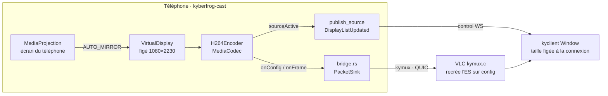
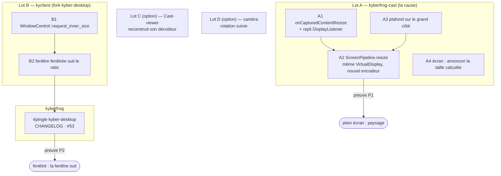

# Partage d'écran Cast qui suit la rotation du téléphone (#53) — plan

*2026-09-30. Plan de développement du constat
[C8 de l'audit résolutions](audit-resolutions.md#c8-telephone-tourne-le-flux-reste-portrait-kyberfrog-cast) :
un téléphone tourné en paysage pendant un partage d'écran KyberFrog Cast
envoie toujours un flux portrait, l'image paysage réduite entre deux bandes
noires. Rien n'est codé ; les lots ci-dessous se font sur des branches
`feat/` dans `kyberfrog-cast` et dans le fork (`kyber-desktop`).*

Chaque affirmation dit ce qu'elle est : **constaté** (lu dans le code ou vu
dans un log réel), **déduit** (lecture sûre, non reproduite), **à
confirmer** (demande le téléphone).

## En bref

- **La cause est entièrement dans le téléphone.** L'écran virtuel Android est
  créé une fois à la taille lue au démarrage, et rien n'écoute la rotation
  (constaté, `VideoSource.kt:223-237`, `CastService.kt:114-116`).
- **La chaîne de réception sait déjà suivre un changement de taille.** Le log
  du viewer du 30/09 le montre : à 15:05:31, le téléphone passe de la caméra
  (1600×1200) au partage d'écran (1080×2230) **en pleine session** ; kyclient
  reçoit `Display list updated`, et VLC réinitialise son décodeur (constaté,
  `kyclient-Nothing-Phone-2.log`). La question ouverte de la carte #53 (« le
  paquet de config H.264 arrive-t-il à une session déjà ouverte ? ») est
  tranchée : oui.
- **Android 14 interdit de recréer l'écran virtuel** sur la même autorisation
  de capture : il faut **redimensionner** celui qui existe, pas relancer le
  pipeline. Android fournit exactement le signal voulu,
  `MediaProjection.Callback.onCapturedContentResize()` (API 34).
- **Un second verrou côté viewer fenêtré** : la fenêtre kyclient garde la
  taille calculée à la connexion. En plein écran, corriger le téléphone
  suffit ; en fenêtré, il faut aussi le lot B.
- **Trois défauts voisins** trouvés en chemin : la limite de taille ne porte
  que sur la largeur (le paysage perdrait deux tiers de ses pixels), le viewer
  du téléphone ne reconstruit pas son décodeur sur une nouvelle config, et la
  caméra suppose le téléphone tenu en portrait.

## 1. Ce que fait la chaîne aujourd'hui

| Maillon | Suit un changement de taille ? | Preuve |
|---|---|---|
| Écran virtuel (`ScreenPipeline`) | **non** : créé une fois, jamais `resize()` | constaté, `VideoSource.kt:229-234` |
| Encodeur (`H264Encoder`) | oui si on en crée un nouveau : il publie sa taille (`Native.sourceActive`) et sa config | constaté, `H264Encoder.kt:29-50` |
| Pont vers kymux (`bridge.rs`) | oui : une nouvelle config part vers la session ouverte | constaté, `bridge.rs:54-60` |
| Trame kymux | oui : un paquet *codec* peut arriver en plein flux (bit haut à 0) | constaté, `packet_source.rs:14-22` |
| VLC (`modules/access/kymux.c`) | oui : `es_out_Del` puis `es_out_Add` avec la nouvelle taille lue dans le SPS | constaté `kymux.c:314-350`, **vu dans le log du 30/09** |
| Liste d'écrans vers kyclient | oui : `Event::DisplayListUpdated`, depuis `f4740be` | constaté, log 15:05:31 |
| Fenêtre kyclient, plein écran | oui : la vidéo est recalée dans le moniteur (`video_layout`) | déduit, `window.rs:243-259` |
| Fenêtre kyclient, fenêtrée | **non** : taille = source ÷ 1,5 à la création, jamais revue | constaté, `event_loop.rs:241-250` ; log 15:14:03 (reconnexion `--stay-open` : liste 1080×2230, fenêtre inchangée) |
| Viewer du téléphone (Cast regardant un autre Cast) | **non** : une 2ᵉ config ne reconstruit pas le décodeur | constaté, `ViewerSession.kt:243-246` → `buildDecoderIfReady` sort si un décodeur existe |

## 2. Constats nouveaux (au-delà de l'audit C8)

### R1 — Android 14 : une seule création d'écran virtuel par autorisation

La doc Android : « sur Android 14 ou plus, `createVirtualDisplay()` lève une
`SecurityException` si l'app l'appelle plus d'une fois sur la même instance
`MediaProjection` » ([Media projection](https://developer.android.com/media/grow/media-projection)).
Arrêter puis relancer `ScreenPipeline` à chaque rotation redemanderait donc
l'autorisation à l'utilisateur. La seule voie propre : garder le
`VirtualDisplay`, lui donner une nouvelle `Surface` d'encodeur
(`setSurface`) et une nouvelle taille (`resize`). Constaté (doc), comportement
sur le Nothing Phone à confirmer.

### R2 — Le bon signal : `onCapturedContentResize()` (API 34)

`MediaProjection.Callback.onCapturedContentResize(width, height)` est appelé
au démarrage de la capture et à chaque changement de taille du contenu
capturé — rotation, ou fenêtre d'app partagée qui change de mode. La doc
Android le recommande précisément pour « redimensionner l'écran virtuel et la
surface afin que la capture ne soit pas en boîte aux lettres ». Le callback
est déjà enregistré (`VideoSource.kt:217-225`), il suffit de surcharger une
méthode. `compileSdk = 34` : disponible à la compilation. Sous API 34, repli
sur `DisplayManager.DisplayListener` + taille réelle de l'écran.

### R3 — La taille de départ est probablement fausse, même en portrait

`resources.displayMetrics`, lu depuis un `Service`, donne 1080×2230 (constaté
dans le log). La fiche du Nothing Phone (2) annonce une dalle 1080×2412 :
les 182 px d'écart sont vraisemblablement les barres système exclues de la
zone d'app. Si c'est le cas, le portrait est déjà légèrement « boîte aux
lettres » aujourd'hui. Déduit, à confirmer : `onCapturedContentResize` donne
la vraie taille au démarrage, ce qui tranchera.

### R4 — La limite de taille ne porte que sur la largeur

`CastService.scale()` plafonne la **largeur** à 1280 px
(`CastService.kt:311-315`). En portrait, 1080 < 1280 : on encode
1080×2230 (2,4 Mpx). En paysage, la même règle donne 1280×618 (0,8 Mpx) :
**un tiers des pixels** du portrait, pour le même écran. Il faut plafonner le
**grand côté**, pour que les deux orientations aient le même budget.

### R5 — La taille retenue d'une session écran trompe la suivante

`publishSource()` préfère la taille mémorisée à la dernière exécution
(`CastService.kt:162-169`). Après une session finie en paysage, le prochain
démarrage en portrait annoncerait du paysage jusqu'au premier encodage. Pour
l'écran, la taille calculée depuis l'appareil est exacte : c'est elle qu'il
faut annoncer, pas la mémoire.

### R6 — Viewer du téléphone : la nouvelle config est ignorée

Côté Cast-viewer, `onConfig` stocke le nouvel `extradata` mais
`buildDecoderIfReady()` ne fait rien si un décodeur tourne déjà
(`ViewerSession.kt:243-266`). MediaCodec sort les SPS/PPS hors bande : après
une rotation (ou un passage caméra ↔ écran), les nouvelles images arrivent
dans un décodeur configuré pour l'ancienne taille. Effet déduit : image
corrompue ou figée. Ne concerne que le cas téléphone → téléphone.

### R7 — Caméra : l'orientation suppose le portrait

`CameraPipeline.cameraRotationValue()` dérive la rotation du capteur en
supposant le téléphone tenu en portrait (`VideoSource.kt:138-158`), une fois
au démarrage. Téléphone tourné avec la caméra active : l'image arrive
couchée. Même geste utilisateur que #53, mais hors de son périmètre. La
correction est légère : la rotation voyage dans l'en-tête codec kymux, et VLC
l'applique à chaque nouvel ES (`kymux.c:221-240`) ; renvoyer la config avec
le nouvel octet de rotation, puis forcer une image clé, suffit.

## 3. Le plan

### Lot A — kyberfrog-cast : l'écran partagé suit la rotation

Base : voir question 1 (la pile de branches non fusionnées porte `f4740be`,
dont ce lot dépend).

- **A1 — Détecter.** Surcharger `onCapturedContentResize(w, h)` dans le
  callback de `ScreenPipeline`. Sous API 34, `DisplayManager.DisplayListener`
  sur `DEFAULT_DISPLAY`, et relire la taille réelle
  (`Display.getRealSize`). Ne réagir qu'à un **changement de taille** : un
  passage 90° ↔ 270° garde la même taille, `AUTO_MIRROR` s'en charge.
- **A2 — Redimensionner sans recréer.** Sur le thread principal, dans cet
  ordre : `display.surface = null` ; arrêter l'ancien `H264Encoder` ; en créer
  un à la nouvelle taille ; `display.resize(w, h, dpi)` ;
  `display.surface = enc.start()`. L'ordre compte : l'ancien encodeur est
  arrêté avant que le nouveau n'envoie sa config, donc aucune image ancienne
  taille ne suit la nouvelle config dans le pont. Le nouvel encodeur publie
  seul sa taille (`Native.sourceActive` → `DisplayListUpdated`) et sa config
  (`Native.onConfig` → session ouverte) : rien à ajouter côté Rust.
  Horodatages : ceux de la surface sont monotones, la suite reste croissante
  (déduit).
- **A3 — Plafonner le grand côté** (R4). `scale()` borne
  `max(w, h)` au lieu de `w`. Valeur : voir question 3.
- **A4 — Annonce de départ** (R5). Pour `Source.SCREEN`, `publishSource()`
  utilise la taille calculée, jamais la taille mémorisée.
- **Livrable** : `CHANGELOG.md` (`[Unreleased]`), `docs/USER-MANUAL.md`
  (le partage d'écran suit la rotation), `TODO.md`.

**Preuve P1** (téléphone + un viewer plein écran) : logcat
`kyberfrog.scr` « resized 1920×…​ » à chaque rotation ; log kyclient
`Display list updated: … width: 1920 …` suivi d'un `Using D3D11VA` ; à l'œil,
une image paysage plein cadre, sans bandes. Retour en portrait : même chose à
l'envers. Dix rotations d'affilée sans gel ni redemande d'autorisation.

### Lot B — kyclient : une fenêtre fenêtrée suit le ratio de la source

Fork `kyber-desktop`, branche depuis `kyberfrog-dev`.

- **B1** — ajouter `request_inner_size(Size)` au trait `WindowControl`
  (`window.rs:44-69`) et à son implémentation winit (fork winit
  `kyber-v0.28.7` : `set_inner_size`).
- **B2** — dans `Window::set_host_display_size` (`window.rs:243-259`) : si le
  **ratio** de la source change (tolérance 1 %) et que la fenêtre n'est ni en
  plein écran ni maximisée, redemander la taille avec la règle de la
  connexion (source ÷ 1,5, bornée à 90 % du moniteur). Le même chemin sert à
  la reconnexion `--stay-open`, qui passe aussi par `display_list_updated`.
- Sortie Spout (`--spout-out`) : pas de fenêtre, rien à faire si la sortie
  Spout de VLC suit la taille décodée (à confirmer au banc).
- **kyberfrog** : bump de l'épingle `vendor/kyber-desktop`, ligne CHANGELOG,
  carte #53.

**Preuve P2** : viewer lancé sans `--fullscreen`, téléphone tourné : la
fenêtre passe de portrait à paysage et l'image la remplit ; redimensionnée à
la main puis téléphone tourné, elle reprend la règle de la connexion.

### Lot C (option) — Cast-viewer : reconstruire le décodeur sur nouvelle config

`ViewerSession.onConfig` : si un décodeur tourne et que l'`extradata`
change, le libérer puis le reconstruire (taille lue du SPS, pas celle
annoncée à la connexion). Preuve : un téléphone en regarde un autre qui
tourne, ou qui passe caméra ↔ écran.

### Lot D (option) — caméra : suivre l'orientation du téléphone

`OrientationEventListener` → nouvel octet de rotation → le pont renvoie la
dernière config avec cette rotation, puis `forceIdr()`. Preuve : caméra
arrière, téléphone tourné, image droite dans le viewer.

## 4. Évaluation

**Pour**
- Le travail est petit et localisé : un callback et une méthode `resize` côté
  téléphone, une méthode de trait côté kyclient. Tout le reste (annonce de
  taille, config en cours de session, recréation du décodeur VLC) existe et a
  été vu fonctionner.
- Suit la voie que recommande Android, et couvre gratuitement le partage
  d'une seule app (Android 14) dont la fenêtre change de taille.
- La preuve se fait à l'œil et dans deux logs déjà écrits.

**Contre**
- Chaque rotation recrée l'encodeur et le décodeur : environ une image clé
  de trou (déduit, ~100-300 ms). Acceptable pour un geste ponctuel, pas pour
  un téléphone qu'on agite.
- Le repli sous API 34 (`DisplayListener`) ne sera pas testé si aucun
  téléphone Android 13 n'est disponible.
- Le lot B demande un build Windows du fork et un bump d'épingle dans
  kyberfrog, pour un cas (viewer fenêtré) rare en régie.

## 5. Pas vérifié

- Rien n'a tourné sur le téléphone : ni `resize()`, ni
  `onCapturedContentResize`, ni la version d'Android du Nothing Phone (2).
- R3 (1080×2230 contre une dalle 1080×2412) repose sur la fiche du
  téléphone, pas sur une mesure.
- Comportement de la sortie Spout de kyclient face à un changement de taille.
- Le log du 28/09 cité par l'audit a été réécrit le 30/09 ; les preuves de
  ce plan viennent du log du 30/09.
