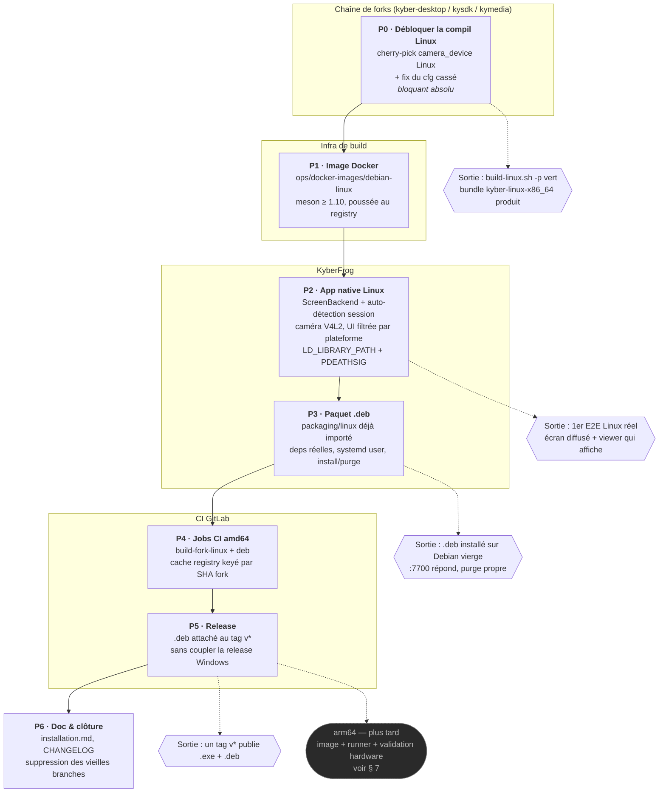
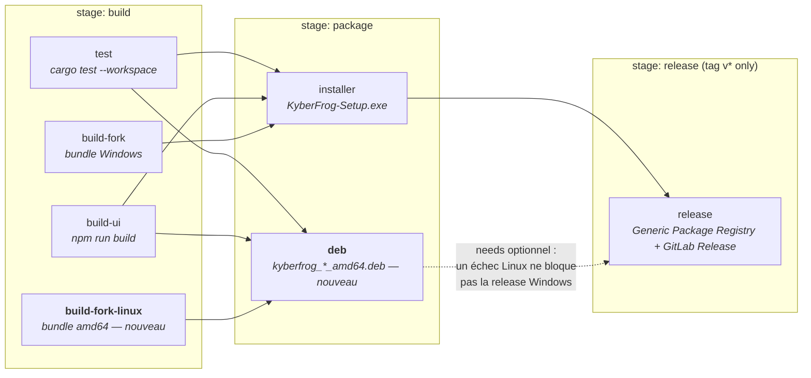

# Plan — support Linux amd64 jusqu'à la release CI

*Étude des branches Linux/ARM existantes (2026-08-16) et plan de reprise.
Objectif : une release `v*` qui produit et publie automatiquement, à côté de
`KyberFrog-Setup-*.exe`, un livrable Linux **amd64** — même chaîne, même tag,
même job `release`.*

**Périmètre arbitré : amd64 seul.** Tout ce qui était ARM/arm64 est mis de côté
(§ 7) : ça doublait le coût de chaque phase et ajoutait une dépendance runner
non résolue, pour un besoin qui n'est pas immédiat. Le plan garde les points de
sortie qui rendront l'ajout d'arm64 mécanique le jour venu.

**Aucun code dans ce document** : état des lieux, schéma, décisions, phases.

---

## 1. Schéma — du dépôt actuel à la release Linux automatique

### Pipeline CI visé (fin de P5)

Les deux jobs neufs sont `build-fork-linux` et `deb` ; tout le reste existe
déjà. Le cache du bundle fork dans le Generic Package Registry (clé = SHA
`kyber-desktop` résolu) est repris tel quel du job Windows : tant que
`packaging/versions.sh` ne bouge pas, le fork n'est pas rebuildé.

---

## 2. État des branches étudiées

Les branches Linux/ARM datent toutes du **24–25 juin 2026** et n'ont **jamais
été buildées ni testées sur Linux** (cases correspondantes de `TODO.md`
toujours vides).

### `kyberfrog@feat/screenbackend-linux`

Un seul commit (`0d52484`), **strictement inclus** dans `feat/linux-arm-support`
où il a été rebasé (`2f57a76`, même arbre). Rien à récupérer.

### `kyberfrog@feat/linux-arm-support`

| Commit | Contenu |
|---|---|
| `2f57a76` | `ScreenBackend` (nvfbc/drm/xcb/wlroots) → `[kyavserver].grab_backend` ; `LD_LIBRARY_PATH` des enfants spawnés ; `PR_SET_PDEATHSIG` ; `packaging/linux/` ; jobs CI Linux |
| `f6c7e3b` | `Source::Camera { device: Option<String> }` (V4L2, `/dev/videoN`) |
| `aed12d0` | CI : matrice `{amd64, arm64}` + release multi-assets |

Base = `18ec958`, soit **67 commits de retard** sur `dev`. Le retard n'est pas
le problème — le modèle de données a divergé sous la branche :

| Branche (25 juin) | `dev` (aujourd'hui) |
|---|---|
| `Source::Screen { backend, display }` | `Source::Screen {}` — le choix de l'écran est passé côté viewer (`display_idx`, #18-B) |
| `Source::Camera { device: Option<String> }` (`/dev/videoN`) | `Source::Camera { device: String }` — nom DirectShow épinglé par CRC (#18-A, validé E2E hardware) |
| — | `Source::All {}` + `[kyavserver].all_sources` (#19) |
| UI = `kyberfrog/src/web/index.html` (legacy) | UI = front React `ui/` (#13), drawer en 2 étapes |
| — | Coquille Tauri/WebView2 (#21) + `shell/stub.rs` hors Windows |
| — | `/cameras`, `/displays`, `/discovered` + mDNS (#20) |

**Ce n'est donc pas un rebase, c'est une re-dérivation** : le patch UI vise un
fichier qui n'est plus l'interface, et les deux variantes de `Source` entrent en
collision avec celles livrées depuis. D'où le découpage P2 (ré-écriture) plutôt
qu'un merge.

### Côté fork — branches jumelles, même date

| Repo | Branche | Contenu |
|---|---|---|
| `kyber-desktop` | `feat/arm-support` | `ARCH_TRIPLET` depuis `uname -m` (ARM) ; le reste = du Spout livré autrement depuis |
| `kysdk/kyctl` | `feat/arm-support` | idem `ARCH_TRIPLET` |
| `kysdk/kymedia` | `feat/arm-support` | `ARCH_TRIPLET` + tout `feat/spout-source` |
| `kysdk/kymedia` | `feat/spout-source` | **`camera_device` Linux (V4L2 via lavd)** + `KYBER_CONFIG_PATH` + `spout_sender` Windows |

Toutes sont **antérieures au rebase 0.27.1** (cascade des 5 repos, 8–9 juillet,
historique réécrit et force-pushé) : elles ne se mergent pas, il faut
cherry-picker.

---

## 3. Constats techniques bloquants

### 3.1 Le fork ne compile probablement plus sur Linux · *bloquant*

Dans `kysdk/kymedia`, `kyavservice/src/video.rs` (~ligne 555), la branche
`#[cfg(target_os = "linux")]` de `create_x264` lit `config.camera_device` —
champ déclaré **`#[cfg(target_os = "windows")]` uniquement** (`video.rs:65`,
`config.rs:101`). Le champ Linux équivalent n'existe que sur la branche non
mergée `kymedia@feat/spout-source` (`d60333b`).

Origine : le commit `9e12149` (« skip hwdownload for pinned camera sources »),
issu du chantier webcam **Windows** #18-A, a introduit la branche Linux sans que
le champ Linux soit là. Invisible jusqu'ici : aucun build Linux ne tourne, ni en
CI ni en local, depuis juin.

→ À confirmer par un `cargo check` Linux réel, mais la lecture des `cfg` est
sans ambiguïté. C'est le premier ticket : tant qu'il est là, rien d'autre n'est
mesurable.

### 3.2 Le défaut de capture Linux est mauvais

`kyavservice` : `grab_backend` vaut **`NvFBC` par défaut** sur Linux. Sur toute
machine non-NVIDIA, un transmetteur écran sans `grab_backend` explicite ne
capture rien. Le mode « backend (auto) » de l'ancienne branche laissait
justement la clé absente → retombait sur ce défaut.

→ Design retenu : **KyberFrog écrit toujours `grab_backend`** sur Linux, avec
auto-détection de session (`WAYLAND_DISPLAY`/`XDG_SESSION_TYPE` → wlroots,
`DISPLAY` → xcb, sinon drm) et override manuel dans l'UI.

### 3.3 L'image Docker `debian-linux` n'existe nulle part

Le job CI de l'ancienne branche référence `${CI_REGISTRY_IMAGE}/debian-linux:*`
avec un commentaire renvoyant à `ops/docker-images/debian-linux` — **répertoire
absent du dépôt**. Même situation que l'image Windows (`kyber/debian-win64:local`,
déjà notée dans `TODO.md`) : construite et poussée à la main, non reproductible.
P1 corrige ça pour Linux ; l'image Windows reste un chantier séparé.

### 3.4 Détails à corriger au passage

- **Dépendances du `.deb`** : `control` liste à la main `libc6, libdrm2,
  libxcb1, libxcb-shm0, libwayland-client0, libpulse0`. À dériver du vrai `ldd`
  du bundle (X11, GL/mesa, alsa manquent probablement) — `dpkg-shlibdeps` ou une
  passe `lintian` sur une Debian propre.
- **Nom du `.deb` vs URL de release** : `build-deb.sh` produit
  `kyberfrog_0.5.1_amd64.deb` (convention Debian : pas de `v`, `-` → `~`) alors
  que le job `release` publierait sous `kyberfrog_${CI_COMMIT_TAG}_amd64.deb`
  (donc `v0.5.1`). À aligner.
- **Ne pas coupler la release Windows** : l'ancienne CI mettait le `.deb` en
  `needs:` dur du job `release` — un échec Linux aurait bloqué la publication de
  l'installeur Windows.
- **Chemins par défaut de `build-deb.sh`** : cherche le bundle fork sous
  `apps/kyber-desktop/…`, layout antérieur au workspace actuel. Cosmétique (la
  CI passe `-f`), mais trompeur en usage manuel.
- **`shared/src/paths.rs`** retombe sur `$HOME/.config/kyberfrog` hors Windows.
  Ça marche ; décider si on respecte `XDG_CONFIG_HOME` / `XDG_STATE_HOME`
  proprement (des logs sous `~/.config` sont discutables).
- **Encodeur** : `kyavservice` expose AMF / NVENC / QSV / VAAPI / x264. Sur
  amd64 le choix existe (VAAPI Intel/AMD, NVENC NVIDIA, x264 en repli) ;
  `gen.rs` force déjà x264 quand l'opérateur n'a rien choisi. Le filtre Linux de
  `create_x264` impose un `scale=w=1920` — à vérifier en P2.
- **Spout et « Tout envoyer » n'existent pas sur Linux** : `spout_sender` et
  `all_sources` sont `cfg(windows)` dans le fork, et seraient ignorées
  silencieusement côté Linux (pas de `deny_unknown_fields`). Pas de casse, mais
  l'UI proposerait des tuiles inopérantes → il faut exposer la plateforme dans
  `/status` pour que le front filtre ses tuiles.

---

## 4. Plan par phases

Tailles indicatives (S ≈ ½ journée, M ≈ 1–2 j, L ≈ 3–5 j), hors temps de build.

### P0 — Débloquer la compilation Linux du fork · **S** · *bloquant*

- Confirmer § 3.1 par un `cargo check` Linux réel de `kymedia`.
- Cherry-picker `d60333b` (`camera_device` Linux) sur la base 0.27.1, en ne
  gardant que la part Linux (le `spout_sender` Windows et `KYBER_CONFIG_PATH`
  sont déjà livrés autrement).
- Faire remonter la cascade : bump du pointeur de submodule `kymedia` dans
  `kysdk`, puis `kysdk` dans `kyber-desktop`.
- **Sortie** : `build-linux.sh -p` vert sur amd64 dans une image Debian, bundle
  `kyber-linux-x86_64.tar.bz2` produit, `bin/` + `lib/` conformes à ce que
  `build-deb.sh` attend.

### P1 — Image de build Linux reproductible · **S/M**

- Créer `ops/docker-images/debian-linux/` (Dockerfile + doc de push) : la
  référence pendante du job CI. Mêmes contraintes que l'image Windows —
  meson ≥ 1.10 requis par kymedia 0.27.
- **Sortie** : image poussée dans le registry du projet, P0 rejouable dedans.

### P2 — KyberFrog natif Linux · **M/L**

Re-dérivation sur le modèle actuel, **pas un merge de l'ancienne branche** :

- `ScreenBackend` sur `Source::Screen` (le champ `display` de l'ancienne branche
  est mort — le choix d'écran vit sur le viewer depuis #18-B), avec l'écriture
  systématique de `grab_backend` et l'auto-détection du § 3.2.
- Caméra : réconcilier `Source::Camera { device: String }` (modèle `dev`,
  DirectShow) avec le cas V4L2. Le fork utilise la même clé `camera_device` et
  le même pin par CRC des deux côtés — la divergence est dans l'énumération
  (`cameras.rs` sonde `ffmpeg -f dshow` et rend une liste vide hors Windows → à
  doubler d'un chemin V4L2). Les 7 bugs latents de lavd corrigés pendant #18-A
  profitent gratuitement à ce chemin.
- Front React : tuiles de source filtrées par plateforme (§ 3.4), sélecteur de
  backend écran, picker caméra alimenté par l'énumération V4L2.
- Reprendre les deux morceaux de `supervisor.rs` de l'ancienne branche
  (`LD_LIBRARY_PATH` des enfants, `PR_SET_PDEATHSIG` comme équivalent Linux du
  Job Object).
- Trancher le point XDG de `paths.rs`.
- **Sortie** : `cargo test --workspace` vert ; `kyberfrog` lancé à la main sur
  une Debian amd64 avec le bundle P0 → un transmetteur écran diffuse, un viewer
  affiche. **C'est le premier vrai E2E Linux du projet.**

### P3 — Paquet `.deb` · **S/M**

- `packaging/linux/` est déjà importé sur cette branche (§ 6), non validé.
- Dépendances réelles (§ 3.4), `lintian` propre, `postinst`/`prerm` testés en
  install → upgrade → purge sur une image vierge.
- Valider le service systemd **user** : autostart au login graphique,
  `KillMode=control-group` qui reape bien kycontroller/kyclient, et documenter
  le cas boîtier headless (autologin sur une seat graphique).
- Retirer le paramétrage arm64 du script (hors périmètre, § 7).
- **Sortie** : `.deb` installé sur une Debian/Ubuntu fraîche →
  `http://localhost:7700/` répond, un transmetteur démarre, la désinstallation
  ne laisse rien.

### P4 — Jobs CI amd64 · **M**

- `build-fork-linux` (cache Generic Package Registry keyé par le SHA
  `kyber-desktop`, comme le job Windows) et `deb`.
- **Maîtriser le coût** : le cache par SHA absorbe l'essentiel (pas de rebuild
  tant que `packaging/versions.sh` ne bouge pas) ; prévoir un gating
  supplémentaire (tags + déclenchement manuel) si les minutes deviennent un
  sujet.
- Pinner les nouveaux SHAs fork dans `packaging/versions.sh`, rejouer
  `fork-lint.sh`.
- **Sortie** : pipeline vert sur MR, `.deb` en artefact.

### P5 — Release · **S**

- `.deb` en asset supplémentaire du job `release`, **sans** rendre la release
  Windows dépendante du succès Linux (§ 3.4).
- Aligner le nom du fichier et l'URL du Generic Package Registry.
- **Sortie** : un tag `v*` de test publie l'`.exe` **et** le `.deb` amd64.

### P6 — Documentation & clôture · **S**

- `docs/user/installation.md` (section Linux : `.deb`, service user, backends,
  cas headless), `docs/dev/building.md` (build Linux), `docs/dev/releasing.md`
  (le nouveau job), nav `mkdocs.yml`.
- `CHANGELOG.md`, `README.md` (« Linux/ARM support (community contribution in
  progress) » à corriger).
- Section 🐧 de `TODO.md` réécrite.
- Suppression des anciennes branches (§ 6), leur contenu étant archivé ici.

---

## 5. Risques

| Risque | Impact | Parade |
|---|---|---|
| Le build fork Linux réserve d'autres surprises que § 3.1 (aucun build depuis juin ; ~15 bugs latents déjà trouvés dans ce fork côté Windows) | P0 déborde | Time-box P0 et remonter tôt ; le pattern de debug C→FFI→Rust du chantier webcam est connu |
| Capture Wayland instable selon le compositeur (wlroots ≠ GNOME/KDE) | support partiel | Périmètre assumé et documenté ; drm/xcb en repli |
| Divergence UI Windows/Linux qui s'installe | dette | Un seul front, filtré par plateforme via `/status` |
| Minutes CI : deux builds fork lourds dans le même pipeline | coût | Cache par SHA + gating ; le fork ne rebuilde qu'au bump de `versions.sh` |

---

## 6. Archive des branches Linux/ARM — ce qui est gardé, ce qui part

Tout est consigné ici **avant** suppression : chaque branche reste restaurable
par son SHA (`git branch <nom> <sha>`), rien n'est perdu.

| Repo | Branche | SHA de tête | Verdict |
|---|---|---|---|
| `kyberfrog` | `feat/screenbackend-linux` | `0d52484e045a7b851edaa66552d170f1c12f925d` | **Supprimer** — inclus dans la branche ci-dessous |
| `kyberfrog` | `feat/linux-arm-support` | `aed12d0018b94f9d43476c1c2b9d0a3d99228c69` | **Supprimer** — `packaging/linux/` importé ici, le reste re-dérivé en P2 |
| `kyber-desktop` | `feat/arm-support` | `a325609d58c34592f42d5dc4ee01fe4564ab718f` | **Supprimer** — ARM seul, hors périmètre |
| `kysdk/kyctl` | `feat/arm-support` | `204d1739a4fd6fd3837b2cbdab4eacc1dded1356` | **Supprimer** — ARM seul, hors périmètre |
| `kysdk/kymedia` | `feat/arm-support` | `e2d58e2c3c833fdf6226424b5c539158882ce6bd` | **Supprimer** — = `feat/spout-source` + le commit ARM |
| `kysdk/kymedia` | `feat/spout-source` | `d60333b810560a96616718baefb226baf92b3ba8` | **Garder jusqu'à P0** — porte le `camera_device` Linux à cherry-picker ; supprimable après |

### Récupéré sur cette branche

- `packaging/linux/` (6 fichiers : `build-deb.sh`, `control`,
  `kyberfrog.service`, `postinst`, `prerm`, `postrm`) importé **verbatim**
  depuis `feat/linux-arm-support`. Non validé, non testé — c'est le point de
  départ de P3, pas un livrable.

### Récupéré sous forme de savoir (dans ce document)

- Le design `ScreenBackend` ↔ `[kyavserver].grab_backend` et la liste exacte
  des backends du fork (§ 3.2).
- Le mécanisme `camera_device` V4L2 par CRC, identique au pin Spout (§ 4/P2).
- Les deux équivalents Linux du Job Object Windows : `LD_LIBRARY_PATH` des
  enfants et `PR_SET_PDEATHSIG` (§ 4/P2).
- La structure des jobs CI et le cache de bundle keyé par SHA (§ 1).

### Volontairement abandonné

- Toute la matrice arm64 (jobs, tags de runner, `ARCH_TRIPLET`) — § 7.
- Le patch UI sur `kyberfrog/src/web/index.html` : ce fichier n'est plus
  l'interface depuis #13.
- `Source::Screen.display` : le choix d'écran est une décision côté viewer
  depuis #18-B.

---

## 7. arm64 — pourquoi c'est repoussé, et ce qu'il faudra

Le besoin n'est pas immédiat et l'ARM doublait le coût de chaque phase. Ce qui
restera à faire le jour où on le reprend :

1. **Un runner** : le tag `saas-linux-medium-arm64` utilisé par l'ancienne
   branche est réservé aux tiers Premium/Ultimate ; le tier gratuit n'a que
   `saas-linux-small-arm64` (2 vCPU / 8 Go), alors que le build fork Windows
   tourne déjà avec `timeout: 3h` après deux dépassements à 1 h 30. Options :
   runner self-hosted sur le hardware ARM, passage Premium, ou bundle fork
   arm64 construit hors CI et poussé une fois dans le Generic Package Registry
   (le cache keyé par SHA rend cette dernière option quasi gratuite).
2. **`ARCH_TRIPLET` dérivé de `uname -m`** dans `build-linux.sh` — trois commits
   déjà écrits, archivés en § 6, à re-cherry-picker sur la base du moment.
3. **Une image `debian-linux` arm64** (P1 est conçu pour accepter un second tag).
4. **Une validation hardware** (Pi 4 / RK3588) : backend `drm` headless, encodeur
   **x264 logiciel uniquement** (pas de VAAPI, rkmpp non supporté par
   `kyavservice`) → il faudra fixer une cible de perf réaliste avant toute
   promesse produit.

Les phases P1 à P5 sont écrites pour que l'ajout d'arm64 soit une extension de
matrice, pas une reprise du plan.
