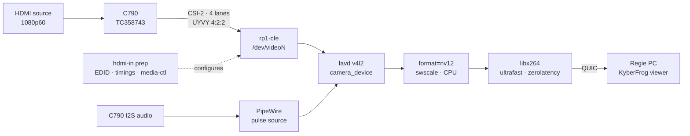
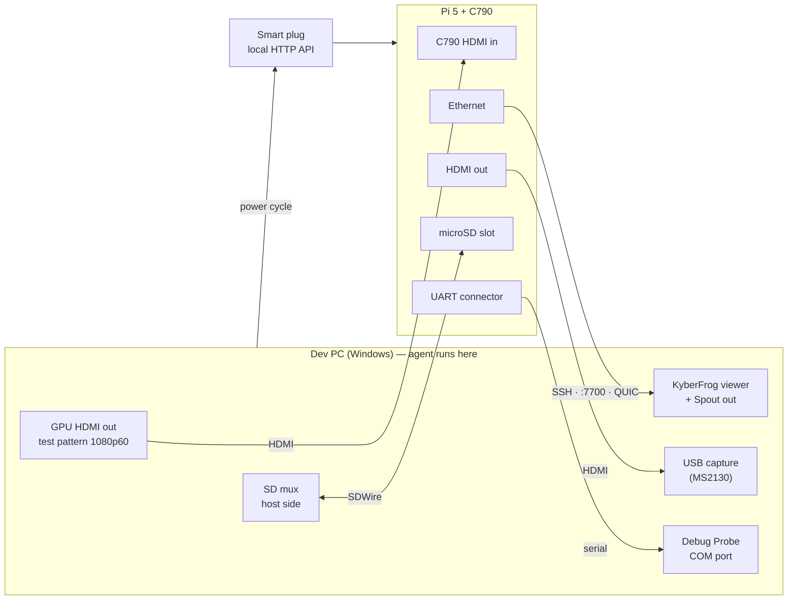

# KyberFrog Satellite (#46) — study

**KyberFrog Satellite** turns a **Raspberry Pi 5 (4 GB)** fitted with a
**Geekworm C790** HDMI-to-CSI-2 bridge into a KyberFrog **transmitter**: any
1080p60 HDMI source plugged into the Pi (a camera, a console, a laptop) becomes
a Kyber stream on the LAN. It ships as a flashable SD-card image: a minimal
Linux that boots straight into KyberFrog, takes an address by DHCP, answers SSH
and the dashboard, and needs neither a keyboard nor a screen to be set up.

This page is a **study**: the scope is not arbitrated yet. The open calls are
listed at the end; everything else is the recommended design.

Status legend: **observed** (read in the code), **sourced** (vendor or
upstream documentation), **deduced**, **to confirm** (needs the Pi and the
C790).

## The finding that shapes the plan: no hardware encoder

**The Pi 5 has no hardware video encoder.** Its only video block is an HEVC
*decoder*; every KyberFrog transmitter on it encodes on the four Cortex-A76
cores. *Sourced*
([Raspberry Pi forums](https://forums.raspberrypi.com/viewtopic.php?t=391283),
[Jeff Geerling](https://www.jeffgeerling.com/blog/2024/can-raspberry-pi-5-handle-4k/)).
Raspberry Pi engineers report that software H.264 **copes with 1080p60 at the
`ultrafast` preset** ([forum](https://forums.raspberrypi.com/viewtopic.php?t=378329)) —
which is exactly what the fork already asks for:

- the fork's `create_x264` sets `preset=ultrafast`, `tune=zerolatency`
  (`kymedia/kyavservice/src/video.rs:575`); *observed*
- with a pinned camera on Linux, the filter graph is `format=nv12` only, with
  no scaling (`video.rs:562`); *observed*
- KyberFrog defaults the encoder to `x264` (`shared/src/gen.rs:73`). *Observed.*

What nobody has measured is the **full budget at 60 fps on one board**: UYVY
4:2:2 → NV12 conversion in swscale, x264, the QUIC sender and kycontroller, all
on four cores, **sustained** (thermal throttling) and **at KyberFrog's
latency**. That is the go / no-go, and it can be answered with stock FFmpeg on
a stock Pi OS before a single hour of fork build (S0).

## The capture chain

**The data path already exists in the fork.** `camera_device` pins a V4L2
device on Linux and restricts kyavserver to `["lavd", "pulse"]` (`kymedia`
`7f0360f`); `libavdevice` is enabled in the Linux FFmpeg build. *Observed.*

**What is missing sits around it:**

| Gap | Where | State |
|---|---|---|
| **Bridge setup.** The TC358743 does not stream until an EDID is loaded, the DV timings of the source are applied, and — on the Pi 5 — the `rp1-cfe` media graph is configured. The media device number changes at every boot. Overlays: `tc358743,4lane=1`, `tc358743-audio`, `vc4-kms-v3d,cma-512` | new system service on the image | ❌ sourced ([Geekworm Pi 5 repo](https://github.com/geekworm-com/RPi5_hdmi_in_card)) |
| **Source changes.** Unplugging the source or changing its resolution invalidates the timings; the service must re-apply them, after which the supervisor's restart brings kyavserver back | same service | ❌ deduced |
| **Stable device name.** `rp1-cfe` exposes several `/dev/videoN` nodes; a udev symlink `/dev/kyberfrog-hdmi-in` gives `camera_device` a name that survives reboots | udev rule | ❌ deduced |
| **Picker in the dashboard.** `list_cameras()` returns an empty list off Windows (`kyberfrog/src/cameras.rs:24`) | #32, app side | ❌ observed |
| **Display enumeration.** On Linux, `EnumerateDisplays` builds its API list from `grab_backend` only and ignores a pinned `camera_device` (Windows honours it) | #32, fork side (`kymedia`) | ❌ observed (`7f0360f` message) |
| **Audio source.** kyavserver captures audio through pulse; which pulse source it opens — the C790's I2S card or the default — is unknown | fork, possibly none | ❓ to confirm |

A transmitter with `source = { camera = { device = "/dev/kyberfrog-hdmi-in" } }`
can be written by hand in `kyberfrog.toml` today (`Source::Camera` and
`gen.rs` handle it), so the picker is not on the critical path of the first
stream — the enumeration gap in the fork may be. *Deduced, to confirm in S3.*

## What already exists

| Need | State today | |
|---|---|---|
| Remote configuration | the web UI binds `0.0.0.0:<web_port>`, no auth on the UI (`kyberfrog/src/web.rs:76`) | ✅ observed |
| Autostart | `kyberfrog.service`, systemd *user*, `WantedBy=default.target`, `KillMode=control-group` | ✅ observed |
| Being found | mDNS announces every active transmitter as `_kyber._tcp`; the regie's viewer picker lists it | ✅ observed |
| Camera source model | `Source::Camera { device }` → `[kyavserver].camera_device` | ✅ observed |
| `.deb` for arm64 | `build-deb.sh -a arm64` already maps to `aarch64` | ✅ observed |
| Runtime glibc | bundle floor **2.39**; Raspberry Pi OS (Trixie) ships 2.41 | ✅ deduced |
| **arm64 fork bundle** | `kyber-desktop/build-linux.sh` hardcodes `rootfs-x86_64-linux-gnu` and the `x86_64-linux-gnu` multiarch dir | ❌ observed |
| **OS image** | nothing | ❌ |

The three commits that make `build-linux.sh` derive `ARCH_TRIPLET` from
`uname -m` exist and are reachable by SHA, on no branch: `kyber-desktop`
`a325609`, `kyctl` `204d173`, `kymedia` `e2d58e2` (2026-06-25). They must be
**cherry-picked** onto the current fork base, not merged.

## Recommended design

### Base OS — Raspberry Pi OS Lite (Trixie, arm64), built with `pi-gen`

- `pi-gen` is Raspberry Pi's own image builder; a custom stage on top of
  `stage2` (Lite) gives an `.img.xz` that **Raspberry Pi Imager** flashes like
  any official image. It runs in Docker, which the dev host already has with
  arm64 emulation (`docker buildx ls` lists `linux/arm64`).
- Trixie brings glibc 2.41, the Pi 5 kernel with the `tc358743` and `rp1-cfe`
  drivers, and the firmware overlays, without any board support work.

### Headless — no display server

A transmitter capturing through V4L2 needs **no X11 and no Wayland**: the
capture comes from the CSI bridge, not from a screen. The image carries no
display server, no autologin session: `loginctl enable-linger kyberfrog`
starts the user's systemd instance at boot, and `kyberfrog.service` with it.
Screen-backend auto-detection lands on `drm` with no `DISPLAY`, and the pinned
camera takes priority over it in the fork. *Deduced.*

### HDMI input service — `kyberfrog-hdmi-in.service`

A **system** service (it needs `/dev/media*` and `/dev/v4l-subdev*`), ordered
before the user instance:

1. load a 1080p60-capable EDID into the bridge;
2. query the source's DV timings and apply them; configure the `rp1-cfe`
   pipeline formats (UYVY8, 1920×1080) whatever media device number it got;
3. maintain the `/dev/kyberfrog-hdmi-in` symlink;
4. wait for `V4L2_EVENT_SOURCE_CHANGE` and loop back to 2.

It publishes its state (`no signal`, `1920x1080p60`, `unsupported`) in a small
status file the dashboard can show later.

### Audio

The image ships **PipeWire + `pipewire-pulse`**: kyavserver's audio goes
through libpulse, which aborts with no server (#31). The C790's I2S input then
appears as a pulse source; making it the default source is a one-line
WirePlumber rule. *Deduced; which source kyavserver opens is to confirm.*

### Power and heat

Sustained x264 at 1080p60 loads all four cores. The **official active cooler**
and the **27 W USB-C supply** are part of the Satellite bill of materials, and
S0 records throttling (`vcgencmd get_throttled`) over a long run.
*Deduced.*

### Network and identity

- **DHCP** through NetworkManager (Pi OS default), Ethernet first; Wi-Fi only
  when pre-seeded — a 1080p60 stream wants the cable.
- **Hostname `kyfrog-sat-XXXX`**, `XXXX` = last four hex digits of the Pi
  serial, set on first boot. Unique on a stage with several satellites,
  printable on a label; it also names the transmitter in mDNS
  (`hdmi@kyfrog-sat-XXXX`).
- **avahi** answers `kyfrog-sat-XXXX.local`, so the dashboard is
  `http://kyfrog-sat-XXXX.local:7700` with no DHCP lease lookup.

### Remote configuration — three layers

1. **Dashboard** (exists): create or edit the transmitter from any browser on
   the LAN. The image **pre-creates** one transmitter on the HDMI input, so a
   fresh Satellite is visible in the regie's picker without any setup.
2. **Boot-partition seed** (new, small): a `satellite.toml` on the FAT boot
   partition, readable from Windows after flashing — hostname override, Wi-Fi,
   SSH public key, transmitter name. Applied once at first boot, then renamed
   `satellite.toml.applied`.
3. **SSH**: full shell for logs, updates and anything the dashboard does not
   expose.

### Security

!!! warning "Two open doors on the LAN"
    The dashboard has **no authentication** today (trusted-LAN design), and a
    Satellite adds **SSH**. A shipped default password would give a shell with
    `sudo` to anyone on the venue network. The recommended default is
    **key-only SSH**: the public key comes from Raspberry Pi Imager's
    customisation or `satellite.toml`, password login is disabled. See open
    question 2.

### Build chain

| Step | Where | Output |
|---|---|---|
| Cherry-pick the three `ARCH_TRIPLET` commits | fork repos | `build-linux.sh` arch-agnostic |
| `debian-linux` image for `linux/arm64` | `docker buildx`, same Dockerfile (`debian:trixie-slim`, rustup) | `kyber/debian-linux:local-arm64` |
| Fork bundle arm64 | same image under QEMU, once per fork SHA | bundle pushed to the Generic Package Registry |
| `kyberfrog_<ver>_arm64.deb` | `build-deb.sh -a arm64` | the same `.deb` a normal Pi OS user can install |
| Satellite image | `pi-gen` stage installing that `.deb` + the HDMI input service | `kyberfrog-satellite-<ver>-arm64.img.xz` |

QEMU-emulated compilation of the fork is slow — the native amd64 build takes
~20 min, expect several hours emulated. The per-SHA cache makes it a one-off per
fork bump. *Duration to confirm.*

### Repository split

The work lands in three places, by what it changes:

| Change | Repository | Why there |
|---|---|---|
| `EnumerateDisplays` honouring a pinned camera; `ARCH_TRIPLET` cherry-picks | fork repos (`kymedia`, `kyber-desktop`, `kyctl`) | fork code, fork build |
| Linux `list_cameras` (#32); `kyberfrog_<ver>_arm64.deb` and its CI job (#35) | **kyberfrog** (this repo) | useful to every Linux user, released with the app |
| `pi-gen` stage, `kyberfrog-hdmi-in.service`, first boot, `satellite.toml`, the test bench tooling | **new project `kyber-frog/kyberfrog-satellite`** | OS image and hardware, released on its own cadence |

The Satellite project **consumes** the arm64 `.deb` published by a KyberFrog
release (pinned by version), exactly as `kyberfrog-cast` sits beside the app
rather than inside it:

- **its own CI**: `pi-gen` under arm64 emulation is long, and it never slows
  down or breaks a KyberFrog pipeline;
- **its own releases**: an image can be rebuilt for a Pi OS security update or
  a service fix without tagging the app;
- **its own bench**: the hardware test tooling (power, serial, SD mux, test
  patterns) has nothing to do in the app repository;
- **focused sessions**: an agent working on the image does not load the app,
  the UI and the Windows packaging.

This study moves to the new project as its founding plan; #46 on this board
keeps a card pointing to it, and #32 / #35 stay numbered here.

## Development bench — hardware in the loop

Every phase after S0 needs the Pi, the C790 and a 1080p60 source. The bench
below lets an agent on the dev PC **build, flash, boot, feed, measure and
recover** the Satellite without a human touching a cable.

| Element | Role | Needed from |
|---|---|---|
| **Ethernet + DHCP reservation + SSH key** | shell, dashboard, stream — the everyday channel | S0 |
| **Dev PC GPU HDMI out → C790** | a deterministic source: a fullscreen test pattern on an extended 1920×1080@60 display, carrying a frame counter and a timecode, plus an audio tick | S0 |
| **KyberFrog viewer + Spout output on the dev PC** | closes the loop: the frame counter read back from the received stream gives **glass-to-glass latency in frames**, and dropped frames, with no camera pointed at a screen | S3 |
| **Raspberry Pi Debug Probe** on the Pi 5's UART connector | boot log, kernel messages and a login when the network is down or the image does not boot | S1 |
| **Smart plug with a local API** (Shelly class, no cloud) | power-cycle a hung Pi; drive the 10× power-cut test of S5 | S2 |
| **SD mux** (SDWire class) | the PC writes a freshly built image onto the card, then hands it to the Pi — flash-and-boot tests with no one pulling the card | S4 |
| **USB HDMI capture** on the Pi's HDMI out | see what the Pi prints on screen (firmware, boot splash, a panic) and, later, test the display role | S4 |

Bench gotchas, to design around rather than discover:

- **No EDID, no output.** The TC358743 presents no EDID until the HDMI input
  service loads one, so Windows does not see the C790 as a display — and the
  test pattern cannot be shown — until the Pi has booted that service. *Deduced.*
- **Keep the pattern display out of the way.** Windows moves windows and
  notifications onto a new monitor; the bench display is set to *extend*, and
  only the pattern window lives there.
- **Scope the agent's reach.** The plug switches the Pi and nothing else; the
  SSH key is dedicated to the bench Pi; the bench scripts are the only way the
  agent drives power and the SD mux.

The tooling (`bench/power`, `bench/flash`, `bench/pattern`,
`bench/measure-latency`) lives in the Satellite project.

## Phases and proofs

| Phase | Content | Done when (proof) |
|---|---|---|
| **S0** — go / no-go, no fork build | stock Pi OS Lite Trixie, C790 overlays, Geekworm's setup script; stock FFmpeg: `-f v4l2 -input_format uyvy422` → `format=nv12` → `libx264 -preset ultrafast -tune zerolatency` → UDP to the regie | a 30-minute run: encode holds **60 fps**, CPU %, `vcgencmd get_throttled` stays `0x0`, glass-to-glass delay vs a PC encoding the same source. **Decides the project** |
| **S1** — arm64 bundle | cherry-picks, arm64 build image, fork bundle, `.deb` | `file kyavserver` → aarch64; `objdump -T` → nothing above `GLIBC_2.41`; `.deb` installs on the Pi |
| **S2** — HDMI input service | EDID, timings, media graph, symlink, source-change loop | boot with the source on, off, and switched 1080p60 → 720p50 → 1080p60: `/dev/kyberfrog-hdmi-in` streams every time |
| **S3** — transmitter on the Pi | hand-written camera transmitter first; then #32 on both sides (Linux `list_cameras`, fork `EnumerateDisplays`); audio source check | the regie's KyberFrog viewer shows the HDMI source at 1080p60 with sound; latency recorded with the #28-4 method; the C790 appears in the dashboard picker |
| **S4** — image | `pi-gen` stage, linger, first-boot service, pre-created transmitter, `satellite.toml` | flash → boot with no keyboard → `hdmi@kyfrog-sat-XXXX` appears in the regie's picker and `http://kyfrog-sat-XXXX.local:7700` answers in under 90 s |
| **S5** — field robustness | power pulled 10× while streaming; HDMI unplugged / replugged | 10/10 boots, stream back without intervention in both cases |
| **S6** — CI and release | image job on tag, `allow_failure` like the Linux chain | `.img.xz` attached to the release |

## Viewer role (later)

The same image could also be a **display** (kyclient fullscreen on the Pi's
HDMI output). It is a separate scope with its own constraints, recorded here so
it is not rediscovered:

- the stream is H.264 and the Pi 5 **decodes H.264 in software** — its HEVC
  hardware decoder needs FFmpeg's V4L2 Request hwaccel, still out of tree
  ([ffmpeg-devel](https://ffmpeg.org/pipermail/ffmpeg-devel/2024-August/332034.html)),
  and the bundle has no `libx265` to produce HEVC anyway;
- kyclient is built with winit `features = ["x11"]` only, so a viewer needs an
  X11 session (autologin → `xinit`) that the transmitter image does not carry.

## Assessment

**For**

- **The data path is already in the fork**: V4L2 capture through `lavd`,
  `camera_device` pinning, x264 `ultrafast`/`zerolatency`, no scaling on the
  camera path.
- **Headless**: no display server on the image, which keeps it small and
  removes the session problems met on desktop Linux.
- **Official base**: Pi firmware, kernel, `tc358743` / `rp1-cfe` drivers are
  Raspberry Pi's; Imager handles flashing and first-boot customisation.
- **Found without setup**: a pre-created transmitter announced over mDNS shows
  up in the regie's picker as soon as the Satellite boots.
- **arm64 (#35) and Linux camera enumeration (#32) land as by-products**, for
  every Linux user.

**Against**

- **Software encoding only**: 1080p60 sits at the edge of what four A76 cores
  do sustained; unmeasured until S0.
- **The TC358743 needs babysitting**: EDID, timings and a media graph to
  reapply at every boot and every source change — a service we own.
- **Heat and power**: active cooler and 27 W supply are mandatory.
- **SD cards and power cuts**: a writable root filesystem on SD can corrupt on
  a hard power pull (open question 3).
- **Unauthenticated dashboard** exposed on every Satellite (#3).
- **Emulated arm64 fork build**: hours per fork bump, on the dev host.

## Open questions

| # | Call | What depends on it | Recommendation |
|---|---|---|---|
| 1 | **Role of v1**: HDMI-in transmitter only, or transmitter + display on the same image? | a display role brings back an X11 session, kyclient, and software H.264 decoding next to the encoder on the same four cores | **transmitter only** |
| 2 | **SSH access**: key-only, or a default password changed at first login? | first-boot service, `satellite.toml` schema, Imager instructions | **key-only**, password login disabled |
| 3 | **Power cuts**: read-only root (overlay) + a small writable data partition, or a plain writable root in v1? | partition layout, where `kyberfrog.toml` lives, S5 | **read-only root** — a stage box gets unplugged |
| 4 | **HDMI audio in v1**, or video first? | C790 I2S wiring, WirePlumber default source, possibly fork code if kyavserver cannot target a pulse source | **in v1**, split out only if S3 shows it needs fork code |
| 5 | **Bench scope**: which bench elements to buy, and when? | how autonomous S1–S5 can run; without the plug and the probe, every hang needs a human | **S0 with what exists** (Ethernet + SSH + GPU out → C790); **Debug Probe + smart plug** before S1; **SD mux + USB capture** before S4 |
