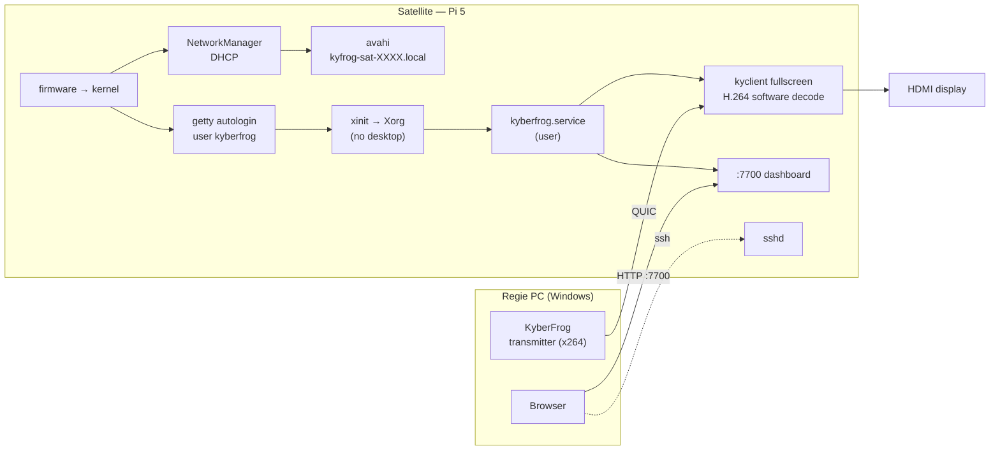

# KyberFrog Satellite (#46) — study

**KyberFrog Satellite** is a flashable SD-card image for the **Raspberry Pi 5
(4 GB)**: a minimal Linux that boots straight into KyberFrog, takes an address
by DHCP, answers SSH and the dashboard on the LAN, and needs neither a keyboard
nor a screen to be set up. Flash, plug HDMI + Ethernet + power, configure it
from the regie PC's browser.

This page is a **study**: the scope is not arbitrated yet. The open calls are
listed at the end; everything else is the recommended design.

Status legend used below: **observed** (read in the code or measured),
**deduced** (follows from what was observed), **to confirm** (needs the Pi).

## What already exists

The Satellite is mostly an assembly of pieces that ship today. The work is
concentrated in two places: an **arm64 fork bundle** and an **OS image**.

| Need | State today | |
|---|---|---|
| Remote configuration | the web UI binds `0.0.0.0:<web_port>`, no auth on the UI (`kyberfrog/src/web.rs:76`) | ✅ observed |
| Autostart | `kyberfrog.service`, systemd *user*, `WantedBy=default.target`, `KillMode=control-group` | ✅ observed |
| Discovery of emitters | mDNS browser, `GET /discovered` feeds the viewer picker | ✅ observed |
| Linux viewer | kyclient fullscreen validated on Debian 13 / X11 amd64 | ✅ observed |
| `.deb` for arm64 | `build-deb.sh -a arm64` already maps to `aarch64` | ✅ observed |
| Runtime glibc | bundle floor **2.39**; Raspberry Pi OS (Trixie) ships 2.41 | ✅ deduced |
| **arm64 fork bundle** | `kyber-desktop/build-linux.sh` hardcodes `rootfs-x86_64-linux-gnu` and the `x86_64-linux-gnu` multiarch dir | ❌ observed |
| **OS image** | nothing | ❌ |

The three commits that make `build-linux.sh` derive `ARCH_TRIPLET` from
`uname -m` exist and are reachable by SHA, on no branch: `kyber-desktop`
`a325609`, `kyctl` `204d173`, `kymedia` `e2d58e2` (2026-06-25). They must be
**cherry-picked** onto the current fork base, not merged.

## The finding that shapes the plan: the Pi 5 video path

**The Pi 5 has no H.264 hardware decoder and no hardware encoder at all.** Its
only video block is a 4K60 **HEVC decoder**; H.264 is decoded in software on the
four Cortex-A76 cores.
([Raspberry Pi forums](https://forums.raspberrypi.com/viewtopic.php?t=391283),
[Jeff Geerling](https://www.jeffgeerling.com/blog/2024/can-raspberry-pi-5-handle-4k/))

Against that, what KyberFrog sends:

- **The stream is H.264.** `render_config()` defaults `[kyavserver].encoder` to
  `x264` (`shared/src/gen.rs:73`), and kyclient's `--video-codec` defaults to
  `h264` (`kyclient/src/main.rs:286`). *Observed.*
- **HEVC has no software encoder in the bundle.** FFmpeg is configured with
  `--enable-libx264` only — no `libx265`. HEVC would have to come from a
  hardware encoder on the emitter (NVENC / AMF / QSV), and the regie's AMF is
  the one already known to crash. *Observed.*
- **The HEVC hardware decoder is not reachable from the bundle.** On the Pi it
  is a V4L2 *stateless* decoder; FFmpeg needs the **V4L2 Request API hwaccel**,
  which is still out of tree (Raspberry Pi / LibreELEC patches). The fork builds
  stock FFmpeg n8.1. *Observed for the fork, sourced for FFmpeg
  ([ffmpeg-devel](https://ffmpeg.org/pipermail/ffmpeg-devel/2024-August/332034.html)).*

**So v1 decodes H.264 in software.** Whether that holds 1080p60 *at KyberFrog's
latency* is the single biggest unknown of the project — and it can be answered
with stock tools on a stock Pi OS before a single hour of fork build (S0 below).
The HEVC hardware path is kept as a conditional v2: it touches the emitter
encoder, the fork's FFmpeg and VLC's decoder output all at once.

## Recommended design

### Base OS — Raspberry Pi OS Lite (Trixie, arm64), built with `pi-gen`

- `pi-gen` is Raspberry Pi's own image builder; a custom stage on top of
  `stage2` (Lite) gives an `.img.xz` that **Raspberry Pi Imager** flashes like
  any official image. It runs in Docker, which the dev host already has with
  arm64 emulation (`docker buildx ls` lists `linux/arm64`).
- Trixie brings glibc 2.41 (≥ 2.39 floor) and the Pi 5 kernel, firmware and
  Mesa `v3d` GLES driver without any board support work.
- Estimated footprint: Lite (~1.3 GB) + Xorg minimal + the KyberFrog bundle.
  *To confirm on the built image.*

### Display session — X11, no desktop

- **X11 is forced by kyclient**: winit is built with `features = ["x11"]` only
  (`kyclient/Cargo.toml`), so a Wayland kiosk compositor (cage, labwc) would
  need XWayland anyway. *Observed.*
- getty autologin on tty1 → `startx` with an `.xinitrc` that disables blanking
  and DPMS, hides the cursor, imports `DISPLAY`/`XAUTHORITY` into the systemd
  user environment, then starts `kyberfrog.service`. This mirrors what the
  amd64 port validated under lightdm, minus the display manager.
- VLC renders through its `gles2` output (enabled in `vlc_linux_options`) on
  the Pi's Mesa `v3d` driver. *To confirm on the Pi.*
- **Idle screen**: until a viewer is configured, the HDMI output shows the
  hostname, IP and dashboard URL — the operator never has to guess where the
  box is.

### Audio

VLC's **pulse** output is the one that instantiates the `kyaudioreg` regulator;
the PipeWire output is disabled in the fork for that reason
(`kymedia/meson.build`). The image therefore ships **PipeWire +
`pipewire-pulse`**, so the pulse output finds a server and HDMI audio keeps the
regulator. This also keeps #31 (libpulse aborting with no server) out of the
viewer path. *Deduced.*

### Network and identity

- **DHCP** through NetworkManager (Pi OS default), Ethernet first; Wi-Fi only
  when pre-seeded.
- **Hostname `kyfrog-sat-XXXX`**, `XXXX` = last four hex digits of the Pi
  serial, set on first boot. Stable across reflashes of the same board, unique
  on a stage with several satellites, printable on a label.
- **avahi** answers `kyfrog-sat-XXXX.local`, so the dashboard is
  `http://kyfrog-sat-XXXX.local:7700` with no DHCP lease lookup.

### Remote configuration — three layers

1. **Dashboard** (exists): add the viewer from any browser on the LAN. Persists
   in `~/.config/kyberfrog/kyberfrog.toml`.
2. **Boot-partition seed** (new, small): a `satellite.toml` on the FAT boot
   partition, readable from Windows after flashing — hostname override, Wi-Fi,
   SSH public key, an initial viewer (`server`, `port`). Applied once at first
   boot, then renamed `satellite.toml.applied`.
3. **SSH** (new in the image): full shell for logs, updates and anything the
   dashboard does not expose.

### Security

!!! warning "Two open doors on the LAN"
    The dashboard has **no authentication** today (trusted-LAN design), and a
    Satellite adds **SSH**. A shipped default password would give a shell with
    `sudo` to anyone on the venue network. The recommended default is
    **key-only SSH**: the public key comes from Raspberry Pi Imager's
    customisation or `satellite.toml`, password login is disabled. See open
    question 2.

### Build chain

| Step | Where | Output |
|---|---|---|
| Cherry-pick the three `ARCH_TRIPLET` commits | fork repos | `build-linux.sh` arch-agnostic |
| `debian-linux` image for `linux/arm64` | `docker buildx`, same Dockerfile (`debian:trixie-slim`, rustup) | `kyber/debian-linux:local-arm64` |
| Fork bundle arm64 | same image under QEMU, once per fork SHA | bundle pushed to the Generic Package Registry |
| `kyberfrog_<ver>_arm64.deb` | `build-deb.sh -a arm64` | the same `.deb` a normal Pi OS user can install |
| Satellite image | `pi-gen` stage installing that `.deb` | `kyberfrog-satellite-<ver>-arm64.img.xz` |

QEMU-emulated compilation of the fork is slow — the native amd64 build takes
~20 min, expect several hours emulated. The per-SHA cache makes it a one-off per
fork bump. *Duration to confirm.*

### Where the code lives

`packaging/satellite/` in this repository: the image consumes the `.deb` of the
same tag, and a release publishes `.exe`, `.deb` and `.img.xz` together. (Open
question 4.)

## Phases and proofs

| Phase | Content | Done when (proof) |
|---|---|---|
| **S0** — go / no-go, no fork build | stock Pi OS Lite Trixie on the Pi 5; the regie streams a 1080p60 x264 `zerolatency` test with stock FFmpeg; the Pi plays it with stock `ffplay` / `mpv` | CPU %, dropped frames, and glass-to-glass delay vs the same stream on a PC. **Decides whether v1 stays H.264** |
| **S1** — arm64 bundle | cherry-picks, arm64 build image, fork bundle, `.deb` | `file kyclient` → aarch64; `objdump -T` → nothing above `GLIBC_2.41`; `.deb` installs on the Pi |
| **S2** — viewer on the Pi | X11 session by hand, kyberfrog.service | a viewer added from the regie browser plays fullscreen on HDMI with sound; latency recorded with the #28-4 method |
| **S3** — image | `pi-gen` stage, first-boot service, idle screen, `satellite.toml` | flash → boot with no keyboard → `ssh` and `http://kyfrog-sat-XXXX.local:7700` answer in under 90 s |
| **S4** — field robustness | power pulled 10× during playback, reboot, config persists | 10/10 boots, viewer back without intervention |
| **S5** — CI and release | image job on tag, `allow_failure` like the Linux chain | `.img.xz` attached to the release |

## Assessment

**For**

- **Almost no new application code**: the Satellite is the existing Linux
  viewer, the existing dashboard and the existing `.deb`, packaged as an
  appliance.
- **Official base**: Pi firmware, kernel and GPU driver are Raspberry Pi's, not
  ours; Imager handles flashing and first-boot customisation.
- **Headless setup end to end**: DHCP + mDNS name + dashboard + seed file.
- **arm64 lands as a by-product** (#35): the same `.deb` works on any Pi OS or
  Debian arm64 box.

**Against**

- **H.264 in software** — the Pi 5's hardware decoder is HEVC-only and not
  reachable from the fork's FFmpeg. Performance is unmeasured until S0.
- **X11 only**, imposed by kyclient's winit features.
- **SD cards and power cuts**: a writable root filesystem on SD can corrupt on
  a hard power pull; a read-only root needs the config moved to a writable
  partition (open question 3).
- **Unauthenticated dashboard** exposed on every Satellite (#3).
- **Emulated arm64 fork build**: hours per fork bump, on the dev host.

## Open questions

| # | Call | What depends on it | Recommendation |
|---|---|---|---|
| 1 | **Role of v1**: passive display only, or also an emitter (USB camera / HDMI capture)? | an emitter adds x264 *encoding* on the A76 (720p30 realistic, 1080p60 not), V4L2 enumeration (#32), and #31 (libpulse) back in the path | **display only** |
| 2 | **SSH access**: key-only, or a default password changed at first login? | first-boot service, `satellite.toml` schema, Imager instructions | **key-only**, password login disabled |
| 3 | **Power cuts**: read-only root (overlay) + a small writable data partition, or a plain writable root in v1? | partition layout, where `kyberfrog.toml` lives (`XDG_CONFIG_HOME`), S4 | **read-only root** — a stage box gets unplugged |
| 4 | **Repository**: `packaging/satellite/` here, or a separate `kyber-frog/kyberfrog-satellite` project (like kyberfrog-cast)? | CI, release coupling | **here** |
| 5 | **S0 on the hardware**: who runs it, and can Claude get SSH to the Pi for S1–S3? | everything after S0 | run S0 first; it is an hour, no build |
