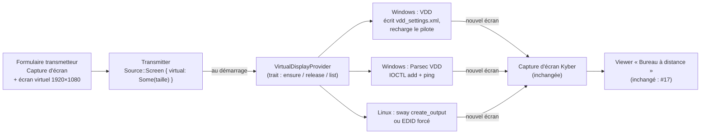

# Écran virtuel pour une machine sans écran — étude

*2026-09-29. Demande opérateur : démarrer un partage d'écran sur une machine
sans écran branché, pour la piloter à distance, via un mode du transmetteur
« Capture d'écran » : **+ ajouter un écran virtuel**. Étude seulement, pas de
code ni de pilote installé : le choix engage l'installation d'un pilote sur
les machines, il revient à l'opérateur.*

## Le problème

Sous Windows, la capture d'écran de Kyber passe par DXGI Desktop Duplication
(`txproto` `iosys_dxgi.c`) : elle capture des **sorties** (moniteurs) de la
carte graphique. Sans écran branché, Windows n'a aucune sortie active : rien
à capturer, et la liste d'écrans annoncée au viewer est vide (et, jusqu'au
correctif `kyctl` `4ba4de0`, un viewer plantait sur une liste vide). Il faut
donc **qu'un écran existe**, réel ou simulé. Sous Linux, même situation côté
KMS/Wayland ; X11 sait tourner sur un écran factice.

Il y a aussi une question de **session** : sans écran, une machine reste
souvent sur l'écran de connexion. La capture Kyber tourne dans la session de
l'utilisateur ; une session ouverte automatiquement (auto-logon) est un
prérequis, quelle que soit la solution d'écran.

## Les possibilités

| Solution | Où | Coût | Pour | Contre |
|---|---|---|---|---|
| **Bouchon HDMI/DP** (émulateur EDID) | matériel | ~10 €, zéro code | marche aujourd'hui, avec AMF/NVENC et la capture DXGI telles quelles ; résolutions de l'EDID (souvent jusqu'en 4K) | une pièce à acheter par machine ; résolution limitée à l'EDID |
| **Virtual Display Driver** (VirtualDrivers, IddCx) | Windows | pilote à installer (admin, une fois) | MIT, **signé**, installable par `winget` ; jusqu'en 8K, 60 à 500 Hz ; utilisé par Sunshine et OBS | pilotage par fichier `C:\VirtualDisplayDriver\vdd_settings.xml` + rechargement du pilote, pas d'API pour ajouter un écran à chaud |
| **Parsec VDD** (+ outil `parsec-vdd`, MIT) | Windows | pilote Parsec à installer | ajout/retrait d'un écran **à chaud** par IOCTL, jusqu'à 16 ; l'écran vit tant que le programme le « ping » : il meurt avec le transmetteur | **pilote propriétaire**, non redistribuable par nous ; 5 résolutions personnalisées max (registre) ; pas avant l'ouverture de session |
| Pilote IddCx maison (exemple Microsoft) | Windows | gros : signature de pilote (EV, attestation Microsoft) | contrôle total | coût de signature et de maintenance hors de proportion |
| **EDID forcé** (`drm.edid_firmware=`, `video=HDMI-A-1:e`) | Linux | paramètre du noyau | la vraie carte croit un écran branché, encodeur GPU inchangé | réglage système, par connecteur |
| **Sortie virtuelle Wayland** (sway `create_output`, mutter `--virtual-monitor`, KWin) | Linux | selon le compositeur | à chaud, sans pilote | dépend du compositeur, à croiser avec le backend de capture Linux (#33) |
| X11 `dummy` / Xvfb | Linux | paquet | simple | Xvfb n'a pas de GPU (encodage CPU) |

## Architecture proposée

Un seul concept dans KyberFrog, **le fournisseur d'écran virtuel**, et le
transmetteur « Capture d'écran » qui s'en sert :

- **Rien ne change dans le fork** : l'écran virtuel est un écran comme un
  autre pour DXGI, AMF et kynput (les clics sont calés sur la position de
  l'écran dans la liste). Le pilotage à distance existe déjà (viewer
  « Bureau à distance », #17).
- KyberFrog **garantit l'écran avant de lancer `kycontroller`** et, selon le
  fournisseur, le libère à l'arrêt (Parsec : le ping s'arrête) ou le laisse
  (VDD : écran persistant, configuré une fois).
- Le formulaire propose l'option seulement si un fournisseur est détecté
  (pilote présent), sinon il explique quoi installer, ou suggère le bouchon HDMI.
- L'installation du pilote reste **hors de l'app** (installeur ou `winget`,
  admin) : KyberFrog tourne en utilisateur et ne doit pas installer de pilote.

## Recommandation

1. **Tout de suite, sans code** : un bouchon HDMI sur la machine sans écran,
   plus l'auto-logon. C'est ce qui marchera le soir d'un show.
2. **Ensuite, fournisseur VDD sous Windows** : licence MIT, pilote signé,
   installable par `winget` ; KyberFrog écrit la résolution demandée dans
   `vdd_settings.xml` et redémarre le périphérique. Point à valider :
   ce redémarrage demande-t-il les droits admin, et faut-il alors un petit
   service installé avec KyberFrog ?
3. Parsec VDD seulement si l'ajout à chaud devient indispensable : techniquement
   le plus élégant (l'écran vit et meurt avec le transmetteur), mais pilote
   propriétaire, à installer par l'opérateur.
4. Linux : EDID forcé pour une machine dédiée, sortie virtuelle Wayland quand
   #33 aura tranché le backend de capture.

## Décision (2026-09-29)

**Windows d'abord, Linux ensuite** (opérateur). Pour les questions 2 à 4, les
recommandations s'appliquent tant que l'opérateur ne tranche pas autrement :
bouchon HDMI sur le terrain en attendant, **VDD** plutôt que Parsec, pilote
installé et configuré **à la main** une fois (pas de service admin). Suivi :
#54 du backlog.

## Réalisé (2026-09-29)

Windows, VDD 25.7.23. Constaté sur le PC de dev :

- **Installer le pilote** demande l'admin une fois : `devcon install MttVDD.inf
  Root\MttVDD` (le paquet `winget` n'installe que l'outil « VDD Control »,
  pas le pilote). C'est la section optionnelle de l'installeur, décochée par
  défaut, qui le fait ; elle écrit aussi `C:\VirtualDisplayDriver\vdd_settings.xml`
  avec **nos** modes (720p, 1080p, 1440p, 4K, 60 Hz).
- **Tout le reste tourne en utilisateur** : le fichier de réglages est
  modifiable par les utilisateurs authentifiés, le pipe
  `\\.\pipe\MTTVirtualDisplayPipe` est ouvert à tous, et
  `ChangeDisplaySettingsEx` choisit la taille, attache l'écran au bureau
  (à droite des écrans réels) et le détache (largeur 0).
- **Pas de rechargement du pilote à chaud** : `RELOAD_DRIVER` envoyé pendant
  que l'écran était détaché l'a fait planter (code 43), et seul un
  redémarrage du périphérique en admin l'a relancé. D'où les modes fixés à
  l'installation, et un KyberFrog qui ne fait qu'attacher et détacher.
- Le pilote garde **toujours un écran** (`SETDISPLAYCOUNT 0` reste à 1) :
  « pas d'écran virtuel » veut dire « écran détaché », invisible pour le
  bureau et pour la capture.
- La capture Kyber le prend comme un écran réel (DXGI, AMF) : rien dans le
  fork.

Modèle : `Source::Screen { virtual_display: Option<{width, height,
refresh_rate}> }`, absent des configurations existantes. Un seul écran
virtuel par machine : un second transmetteur qui en demande un est refusé.
Code : `kyberfrog/src/virtual_display.rs`, `supervisor.rs`
(`start_transmitter` / `stop`).

## Questions

1. ~~Quelle machine~~ : **Windows d'abord** (réponse du 2026-09-29).
2. **Bouchon HDMI acceptable** comme solution de terrain, le fournisseur
   logiciel venant ensuite ? (reco : oui)
3. **VDD ou Parsec VDD** sous Windows ? (reco : VDD, pour la licence)
4. Un **service admin** installé avec KyberFrog est-il acceptable pour
   recharger le pilote, ou l'opérateur installe/configure le pilote à la
   main une fois ? (reco : à la main d'abord)

## Sources

- [VirtualDrivers/Virtual-Display-Driver](https://github.com/VirtualDrivers/Virtual-Display-Driver) (MIT, signé, `winget install VirtualDrivers.Virtual-Display-Driver`, `vdd_settings.xml`)
- [nomi-san/parsec-vdd](https://github.com/nomi-san/parsec-vdd) (IOCTL add/remove, ping de maintien, pilote Parsec propriétaire)
- [LizardByte (Sunshine) — discussion pilote d'écran virtuel](https://github.com/orgs/LizardByte/discussions/230)
