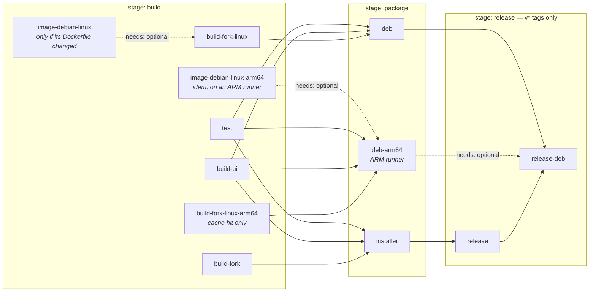

# Releasing & CI

## Versioning — one source of truth

**The git tag is the version.** A `v<version>` tag cuts a release: CI passes it
to `packaging/build-installer.sh` and `packaging/linux/build-deb.sh`, which
export it as `KYBERFROG_VERSION` (baked into the binary by `build.rs`) and hand
it to NSIS / `dpkg-deb`. One value everywhere, nothing to keep in sync.

`version` under `[workspace.package]` in `Cargo.toml` is **only an offline
fallback**, used when there is no exact tag: local and MR builds are then named
`<cargo-version>-<short-sha>` (`<cargo-version>~<short-sha>` for the `.deb`, as
Debian gives `-` a meaning of its own). There is **no bump to do** when cutting
a release, and no check tying the tag to the Cargo version.

### Cut a release

```sh
git tag v0.5.2 && git push origin v0.5.2
```

CI then attaches to the [GitLab
Release](https://gitlab.com/kyber-frog/kyberfrog/-/releases):

- `KyberFrog-Setup-v0.5.2.exe` — the Windows installer;
- `kyberfrog_0.5.2_amd64.deb` — the Debian/Ubuntu package, **when the Linux
  chain succeeded** (see below);
- `kyberfrog_0.5.2_arm64.deb` — the Raspberry Pi OS Trixie package, **when the
  arm64 chain succeeded**, which additionally needs the fork bundle for that
  `kyber-desktop` SHA to have been uploaded (see below).

Follow [SemVer](https://semver.org): patch for fixes, minor for features, major
for breaking config/CLI changes. Add the matching section to `CHANGELOG.md`
before tagging.

## The pipeline (`.gitlab-ci.yml`)



The dashed arm64 branch is `allow_failure` end to end — it can go red without
touching anything else on the diagram.

`pages` is not in this graph: it has `needs: []` and runs on the default branch
only, independently of the build chain.

| Job | What it does |
|-----|--------------|
| **test** | `cargo test --workspace --locked` on the Linux host target (Win32 → stubs). Fast; gates both packages. |
| **build-ui** | `npm ci && npm run build` → `ui/dist`, bundled next to the binary by both packagers. |
| **build-fork** | Clone + build the Kyber fork bundle for Windows (`kyber-desktop/build-win32.sh`). Heavy; cached in the Generic Package Registry keyed by the resolved `kyber-desktop` SHA. |
| **build-fork-linux** | Same for Linux amd64 (`build-linux.sh`), its own cache key. Checks the bundle really contains `kycontroller`/`kyavserver`/`kyclient` before anyone downstream trusts it. |
| **build-fork-linux-arm64** | Downloads the arm64 bundle from the same cache and runs the same check. **Never builds**: on a miss it fails at once, printing the local command — see below. |
| **image-debian-linux** | Builds and pushes the Linux build image (Kaniko) — only when `ops/docker-images/debian-linux/` changed. |
| **image-debian-linux-arm64** | The same image for arm64, on an ARM runner: Kaniko builds for the architecture it runs on. |
| **installer** | `cargo build` `kyberfrog.exe`, then `makensis` → `KyberFrog-Setup.exe`. |
| **deb** | `cargo build` `kyberfrog`, then `packaging/linux/build-deb.sh` → `kyberfrog_<version>_amd64.deb`, checked with `lintian --fail-on error`. |
| **deb-arm64** | The same, `-a arm64`, on an ARM runner (`dpkg-shlibdeps` needs real arm64 packages). Also asserts the binaries are `ARM aarch64` and use no symbol above `GLIBC_2.41`. |
| **release** | On a `v*` tag: upload the installer to the package registry and create the GitLab Release linking it. |
| **release-deb** | On a `v*` tag: upload every `.deb` that reached it (amd64, arm64) and attach each to that release as an extra asset. |
| **pages** | Build the MkDocs site → `public/` on the default branch. Independent (`needs: []`). |

### When pipelines run

The surface is declared once, in `workflow:rules`, not job by job:

- **merge requests**, pushes to **`dev`**, pushes to the **default branch**, and
  **tags**;
- **nothing on a working branch** (`feat/*`…) until it has a merge request — no
  minutes spent on code not yet proposed for integration;
- **no duplicates**: when a branch has an open MR, only the MR pipeline runs —
  a push to `dev` with an open MR to `main` yields one pipeline, not two.

Every job is **automatic** — there is no manual button anywhere in the chain.
Jobs that carry their own `rules` only *narrow* that surface: `release` and
`release-deb` to `v*` tags, `pages` to the default branch,
`image-debian-linux` (and its arm64 twin) to a change under
`ops/docker-images/debian-linux/`.

### The Linux chain never holds back a Windows release

On a **tag**, `build-fork-linux` and `deb` are `allow_failure: true`: a broken
Linux build cannot stop `installer` → `release`. Everywhere else (MR, `dev`,
default branch) they are blocking, exactly like the Windows jobs — a Linux
regression has to be visible before the merge.

That is also why the `.deb` is attached by a **separate job** rather than being
one more entry in the `release:` block of the `release` job: that block is
static, so a tag whose Linux chain failed would publish a release adorned with a
dead link. `release-deb` only runs with a package in hand, and is itself
`allow_failure` — if the Release Links API ever refuses the job token, the
`.deb` is still published in the Generic Package Registry, at the URL printed in
the job trace.

### SaaS-runner notes

- Jobs are untagged so GitLab.com shared runners pick them up.
- The MinGW image must live in **this** project's registry — a `kyber-frog` CI
  token can't pull from `kyber.stream`'s private registry. Push it once:
  ```sh
  docker login registry.gitlab.com
  docker tag kyber/debian-win64:local "$CI_REGISTRY_IMAGE/debian-win64:latest"
  docker push "$CI_REGISTRY_IMAGE/debian-win64:latest"
  ```
  The Linux image is not in that situation: it is reproducible from this repo
  and CI builds it itself.
- The fork's submodules use SSH URLs; CI rewrites them to token HTTPS
  (`git config --global url."https://gitlab-ci-token:…".insteadOf "git@gitlab.com:"`).
- A fork build from scratch costs ~1 h 30 on a shared runner. Both fork jobs hit
  their cache as long as `packaging/versions.sh` doesn't move; the dev loop for
  the Linux bundle runs [on the workstation](building.md#building-for-linux-amd64),
  not here.
- `deb-arm64` and `image-debian-linux-arm64` are the only tagged jobs in the
  chain: they ask for `saas-linux-small-arm64`, the free tier's ARM runner.

### The arm64 fork bundle is built here, not in CI

Everything else in this pipeline can be rebuilt from a tag. The arm64 fork
bundle cannot, and that is a deliberate trade rather than an omission:

- **Kaniko does not cross-compile** — it builds the image of the architecture it
  runs on — and this project's Kubernetes runner cannot grant `docker:dind` the
  privileged pod it would need.
- **SaaS runners cap at 3 h.** A native amd64 fork build already takes ~1 h 30;
  the free tier's only ARM runner is smaller, and emulation is out of the
  question.

So the bundle is built on the workstation, in an emulated `linux/arm64`
container where nothing caps at 3 h, and pushed **once per `kyber-desktop`
SHA** into the Generic Package Registry:

```sh
packaging/linux/build-fork-local.sh -a arm64 -b
# then the curl the script prints, with a PAT scoped `api`
```

`build-fork-linux-arm64` then only ever takes the cache hit. On a miss it fails
immediately, printing that command — it never starts a build that would not
finish. A miss happens exactly when `packaging/versions.sh` moves, which is the
same moment the new bundle has to be uploaded anyway.

### The arm64 chain never holds back anything

`build-fork-linux-arm64`, `deb-arm64` and `image-debian-linux-arm64` are
`allow_failure` **everywhere**, not only on a tag like the amd64 chain. Between
a `versions.sh` bump and the bundle upload the chain is red by construction, and
the package has not yet been installed on a Pi — neither is a reason to hold a
merge or a Windows release. It becomes blocking (`*linux_rules`) when the bundle
comes from a runner and a Pi has confirmed the install.

`release-deb` publishes whichever `.deb` files reached it, so a tag whose arm64
chain failed still ships the amd64 package — the same reasoning that kept the
`.deb` out of the static `release:` block.

## Documentation site

The `pages` job builds the MkDocs Material site (`mkdocs.yml`, sources in
`docs/`) with `mkdocs build --strict` and publishes `public/` to GitLab Pages at
<https://kyber-anysource-b41fc4.gitlab.io/>. `--strict` fails the build on broken
links or nav, so keep internal links valid.
