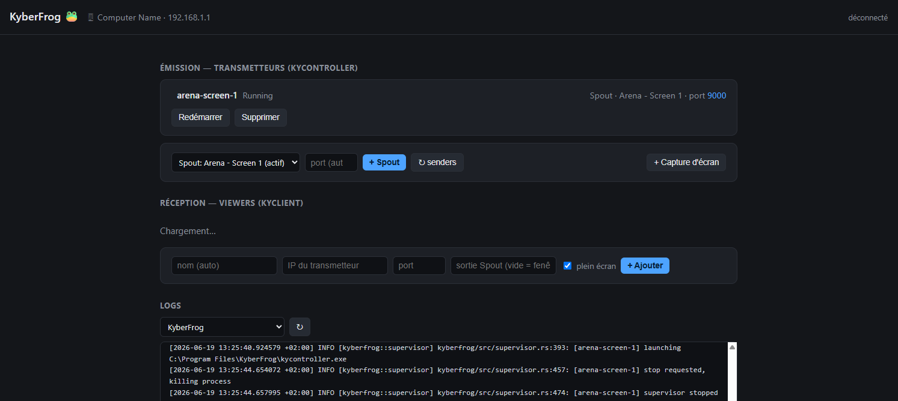

# KyberFrog 🐸

> **KyberFrog.exe lets you create transmitters and clients — from its web UI on
> `:7700` — to send Spout sources between Windows PCs with very low latency.**



A polyvalent orchestration layer on top of [Kyber](https://kyber.stream):
publish **any source** as one of **N independent transmitters** and supervise
the viewers, for low-latency, source-agnostic streaming over LAN — a drop-in
replacement for NDI.

KyberFrog is **one app, installed on every machine**. There is no separate
"server" and "client" build: the role — **emit**, **receive**, or **both** — is
set entirely by the config and the web UI.

```
            ┌──────────── Regie PC (KyberFrog) ───────────┐
  Resolume ─Spout A─▶  emission ─▶ kycontroller :9000 ─┐   │
  Resolume ─Spout B─▶           ─▶ kycontroller :9001 ─┤   │
            └──────────────────────────────────────────│───┘
                                                        │ LAN (QUIC)
                          ┌─────────────────────────────┘
                          ▼                     ▼
              Display A (KyberFrog)   Display B (KyberFrog)
                reception → kyclient    reception → kyclient
                 fullscreen viewers      fullscreen viewers
```

The motivating setup (VJing): **Resolume Arena** on the regie machine publishes
several **Spout** outputs; each is streamed over LAN (QUIC) to display machines
running `kyclient` fullscreen.

## Where to go next

<div class="grid cards" markdown>

-   :material-account: **I want to use KyberFrog**

    ---

    Install it, add your first transmitter and viewer, fix common problems.

    [:octicons-arrow-right-24: User Manual](user/index.md)

-   :material-code-braces: **I want to build or contribute**

    ---

    Architecture, building from source (incl. the Kyber fork), releasing, CI.

    [:octicons-arrow-right-24: Developer docs](dev/index.md)

</div>

## At a glance

| | |
|---|---|
| **Sources** | Spout (Windows GPU texture share), screen capture (more planned) |
| **Transport** | Kyber over QUIC (LAN) |
| **Per machine** | one `kyberfrog.exe`, one web UI on `:7700`, one tray, one `kyberfrog.toml` |
| **Install** | single `KyberFrog-Setup.exe` — bundles the Kyber fork binaries, no manual PATH |
| **Licence** | AGPL-3.0 |
| **Repo** | [gitlab.com/kyber-frog/kyberfrog](https://gitlab.com/kyber-frog/kyberfrog) |
